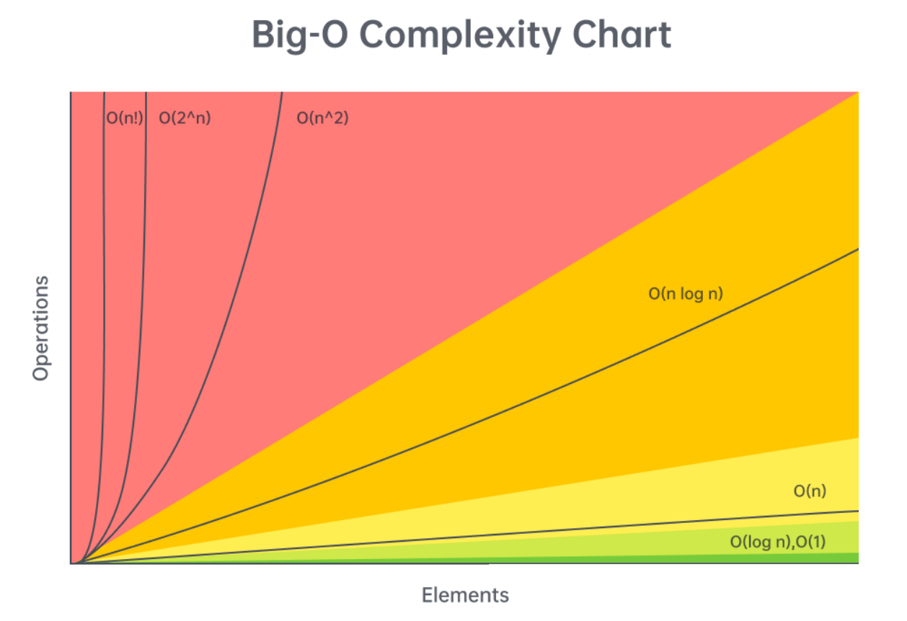
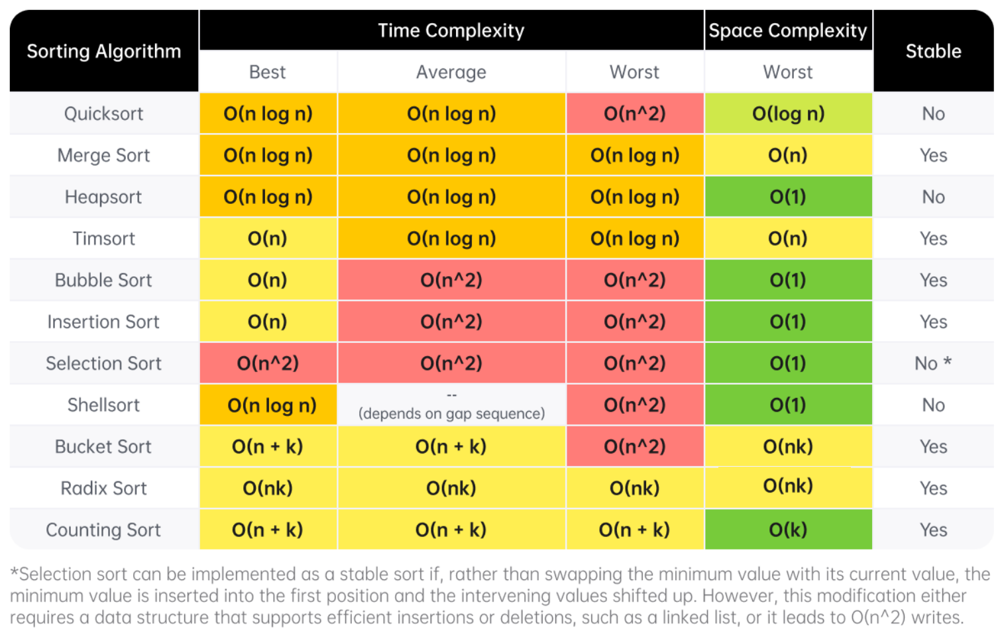
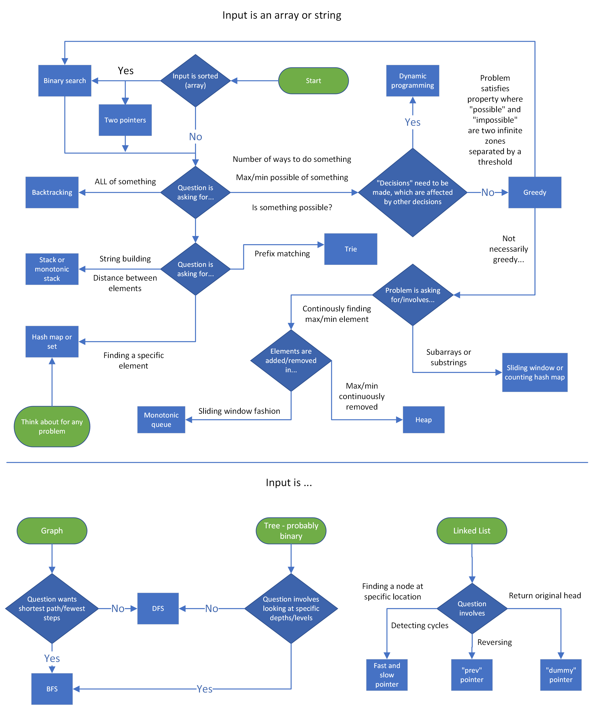

# LeetCode 演算法與資料結構 Cheat Sheet

## 1. 時間複雜度 (Big O) 速查表

### Arrays (Dynamic Array / List)

*Given $n = \text{arr.length}$*

- **Add or remove element at the end:** $O(1)$ amortized
- **Add or remove element from arbitrary index:** $O(n)$
- **Access or modify element at arbitrary index:** $O(1)$
- **Check if element exists:** $O(n)$
- **Two pointers / Sliding window:** $O(n \cdot k)$ ($k$ 是每輪的工作量)
- **Building a prefix sum:** $O(n)$
- **Subarray sum using prefix sum:** $O(1)$

### Strings (Immutable)

*Given $n = \text{s.length}$*

- **Add or remove character:** $O(n)$
- **Access element at arbitrary index:** $O(1)$
- **Concatenation ($s_1 + s_2$):** $O(n + m)$ ($m$ 為另一字串長度)
- **Create substring:** $O(m)$ ($m$ 為子字串長度)
- **Two pointers / Sliding window:** $O(n \cdot k)$
- **Join array to string / StringBuilder:** $O(n)$

### Linked Lists

*Given $n$ as the number of nodes*

- **Add/remove with pointer before target:** $O(1)$
- **Add/remove at current pointer (Doubly Linked):** $O(1)$
- **Add/remove/access at arbitrary position without pointer:** $O(n)$
- **Check if element exists:** $O(n)$
- **Reverse between position $i$ and $j$:** $O(j - i)$
- **Detect a cycle:** $O(n)$ (Fast-slow pointers / Hash Map)

### Hash Table / Dictionary & Set

*Given $n = \text{size}$*

- **Add / Remove key-value pair / Set element:** $O(1)$
- **Check if key / element exists:** $O(1)$
- **Access / Modify value by key:** $O(1)$
- **Check if value exists (Hash Table):** $O(n)$
- **Iterate over all keys / values:** $O(n)$
*註：若 Key 為字串，雜湊運算需額外花費 $O(m)$ 時間（$m$ 為字串長度）。*

### Stack & Queue

- **Stack (Dynamic Array):** Push $O(1)$, Pop $O(1)$, Peek $O(1)$, Search $O(n)$
- **Queue (Doubly Linked List):** Enqueue $O(1)$, Dequeue $O(1)$, Peek $O(1)$, Search $O(n)$

### Trees & Graphs

- **Binary Tree (DFS/BFS):** $O(n \cdot k)$ ($n$ 為節點數，$k$ 為每節點處理時間，通常為 $O(1)$)
- **Binary Search Tree (BST):** Search / Insert / Delete：平均 $O(\log n)$，最壞 $O(n)$
- **Heap / Priority Queue:** Push $O(\log n)$, Pop Min/Max $O(\log n)$, Find Min/Max $O(1)$
- **Binary Search:** $O(\log n)$
- **Graph DFS / BFS:** 時間 $O(n \cdot k + e)$，空間 $O(n + e)$ ($n$ 為點，$e$ 為邊)
- **Dynamic Programming:** 時間 $O(n \cdot k)$，空間 $O(n)$ ($n$ 為狀態數，$k$ 為轉移複雜度)

## 2. 輸入規模 (Input Size) 與預期複雜度對照

| 輸入規模 ($n$) | 預期時間複雜度 | 建議演算法 / 思路 |
| :--- | :--- | :--- |
| $n \le 10$ | $O(n!)$ 或 $O(4^n)$ | Backtracking、窮舉搜尋 |
| $10 < n \le 20$ | $O(2^n)$ | Backtracking、遞迴、子集/子序列列舉 |
| $20 < n \le 100$ | $O(n^3)$ | 三重迴圈、暴力解（Easy 題常見） |
| $100 < n \le 1,000$ | $O(n^2)$ | 雙重迴圈、DP |
| $1,000 < n < 100,000$ | $O(n \log n)$ 或 $O(n)$ | 排序、Heap、Hash Map、Two Pointers、Sliding Window、Monotonic Stack、Binary Search |
| $100,000 < n < 1,000,000$ | $O(n)$ | Hash Map、單次 Iterate |
| $n \ge 1,000,000$ | $O(\log n)$ 或 $O(1)$ | Binary Search、數學公式、常數時間 Hash 技巧 |

---

## 3. 排序演算法複雜度 (Sorting Algorithms)

---

## 4. DS/A 解題決策流程圖 (Decision Flowchart)

---

## 5. 面試 7 大階段 (Interview Stages)

1. **Introductions (自我介紹)**：準備 30-60 秒簡短介紹（背景、經驗、興趣），自信表達。
2. **Problem Statement (理解題目)**：用自己的話覆述題目，詢問輸入規模、邊界條件 (Edge cases) 與無效輸入，舉例確認理解。
3. **Brainstorming DS&A (構思解法)**：邊想邊講 (Think out loud)，將問題拆解，確認複雜度後先與面試官討論並達成共識再動筆。
4. **Implementation (程式碼實作)**：邊寫邊解釋邏輯，維護程式碼乾淨度，避免重複代碼，卡住時主動溝通。
5. **Testing & Debugging (測試與除錯)**：用測試資料追蹤變數狀態；若有 Bug，透過手動追蹤或 Print 語法找出原因。
6. **Explanations and Follow-ups (解釋與延伸)**：說明時間與空間複雜度；說明為何選擇此資料結構；思考是否有更優解。
7. **Outro (提問環節)**：準備 1-2 個關於公司或團隊的問題，展現積極度。

---

## 參考來源

https://leetcode.com/explore/interview/card/cheatsheets/720/resources/4725/
