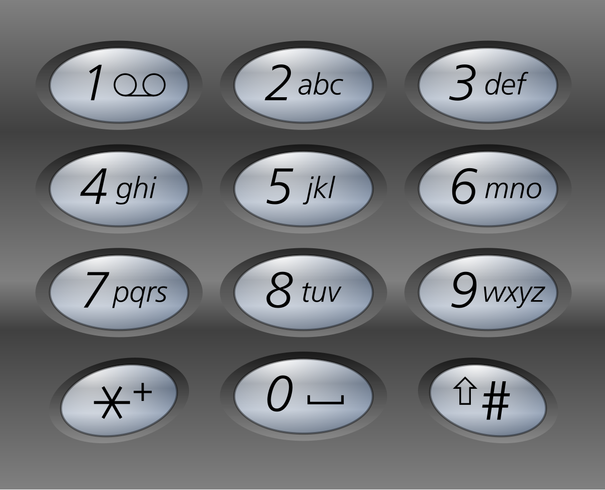

# 17. Letter Combinations of a Phone Number

<span style="color: #f59e0b;"><strong>Medium</strong></span>

## Problem

Given a string containing digits from 2-9 inclusive, return all possible letter combinations that the number could represent. Return the answer in any order.

A mapping of digits to letters (just like on the telephone buttons) is given below. Note that 1 does not map to any letters.



### Example 1

```text
Input: digits = "23"
Output: ["ad","ae","af","bd","be","bf","cd","ce","cf"]
Explanation: Digit 2 maps to "abc" and digit 3 maps to "def", so there are 3 × 3 = 9 combinations.
```

### Example 2

```text
Input: digits = "2"
Output: ["a","b","c"]
Explanation: Digit 2 maps to the letters "abc".
```
 

Constraints:

1 <= digits.length <= 4
digits[i] is a digit in the range ['2', '9'].

## Answer

使用回溯法逐位建立字母組合。每次根據目前數字取得可選字母，將其中一個字母加入路徑後，繼續處理下一個數字；當路徑長度等於輸入長度時，就得到一個完整組合並加入答案。

```java
import java.util.ArrayList;
import java.util.List;

class Solution {
    public List<String> letterCombinations(String digits) {
        List<String> result = new ArrayList<>();

        if (digits == null || digits.isEmpty()) {
            return result;
        }

        String[] phone = {
            "", "", "abc", "def", "ghi", "jkl",
            "mno", "pqrs", "tuv", "wxyz"
        };

        backtrack(digits, 0, phone, new StringBuilder(), result);
        return result;
    }

    private void backtrack(
            String digits,
            int index,
            String[] phone,
            StringBuilder path,
            List<String> result) {
        // 所有數字都已處理完，將目前路徑加入答案。
        if (index == digits.length()) {
            result.add(path.toString());
            return;
        }

        String letters = phone[digits.charAt(index) - '0'];
        for (int i = 0; i < letters.length(); i++) {
            // 將目前字母接到路徑後，進入下一層回溯。
            StringBuilder nextPath = new StringBuilder(path)
                    .append(letters.charAt(i));
            backtrack(digits, index + 1, phone, nextPath, result);
        }
    }
}
```

### 說明

1. `phone` 陣列記錄每個數字對應的字母，其中 `7` 和 `9` 各有四個字母，其餘數字各有三個字母。
2. `path` 代表目前正在建立的組合；每次遞迴都複製出新的 `nextPath`，加入目前字母後再傳入下一層，因此不需要手動還原路徑。
3. 時間複雜度為 `O(4^n × n)`，其中 `n` 是輸入長度；每個組合長度為 `n`，且每個數字最多有四種選擇。
4. 額外空間複雜度為 `O(n^2)`，因為遞迴堆疊中的每一層都保留一份不同長度的 `StringBuilder`，不計算儲存答案所需的空間。
