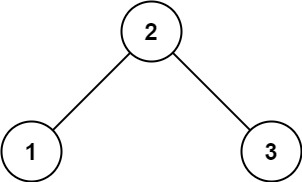
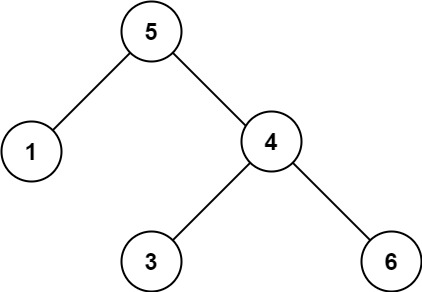

# 98. Validate Binary Search Tree

## Problem

<span style="color: #f59e0b;"><strong>Medium</strong></span>

Given the `root` of a binary tree, determine if it is a valid binary search tree (BST).

A valid BST is defined as follows:

- The left subtree of a node contains only nodes with keys strictly less than the node's key.
- The right subtree of a node contains only nodes with keys strictly greater than the node's key.
- Both the left and right subtrees must also be binary search trees.

### Example 1



```text
Input: root = [2,1,3]
Output: true
```

### Example 2



```text
Input: root = [5,1,4,null,null,3,6]
Output: false
Explanation: The root node's value is 5 but its right child's value is 4.
```

### Constraints

- The number of nodes in the tree is in the range `[1, 10^4]`.
- `-2^31 <= Node.val <= 2^31 - 1`

<https://leetcode.com/problems/validate-binary-search-tree/description/?envType=study-plan-v2&envId=top-interview-150>

## Answer

### 解題思路

每個節點不能只和自己的左右子節點比較，還必須符合所有祖先節點留下的範圍限制。例如右子樹中的每個節點都必須大於根節點，左子樹中的每個節點都必須小於根節點。

因此使用遞迴 DFS，對每個節點維護兩個邊界：

- `lowerBound`：目前節點必須嚴格大於的下界。
- `upperBound`：目前節點必須嚴格小於的上界。

走到左子樹時，當前節點值會成為新的上界；走到右子樹時，當前節點值會成為新的下界。若任一節點違反邊界，就不是合法 BST。

```java
class Solution {
	public boolean isValidBST(TreeNode root) {
		return validate(root, null, null);
	}

	private boolean validate(TreeNode node, Long lowerBound, Long upperBound) {
		// 空節點不會違反 BST 規則，可視為合法子樹。
		if (node == null) {
			return true;
		}

		long value = node.val;

		// BST 要求嚴格小於或大於，重複值也會讓條件失敗。
		if (lowerBound != null && value <= lowerBound) {
			return false;
		}
		if (upperBound != null && value >= upperBound) {
			return false;
		}

		// 左子樹必須小於目前節點；右子樹必須大於目前節點。
		return validate(node.left, lowerBound, value)
			&& validate(node.right, value, upperBound);
	}
}
```

### 說明

1. 根節點一開始沒有上下界，因此傳入 `null` 表示尚未受限制。
2. 遞迴到左子樹時，左子樹所有節點都必須小於目前節點，所以目前節點值成為新的 `upperBound`。
3. 遞迴到右子樹時，右子樹所有節點都必須大於目前節點，所以目前節點值成為新的 `lowerBound`。
4. 題目允許 `Node.val` 到 `int` 邊界，因此用 `Long` 儲存上下界，避免用 `node.val - 1` 或 `node.val + 1` 時發生溢位。
5. BST 不允許重複值，所以比較條件使用 `<= lowerBound` 與 `>= upperBound`。

時間複雜度：`O(n)`，其中 `n` 是樹中的節點數；每個節點最多被拜訪一次。

空間複雜度：`O(h)`，其中 `h` 是樹高；遞迴呼叫堆疊最多保存一條從根節點到葉節點的路徑，最壞情況為 `O(n)`。