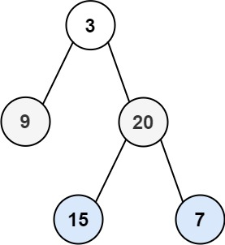

# 102. Binary Tree Level Order Traversal

## Problem

<span style="color: #f59e0b;"><strong>Medium</strong></span>

Given the root of a binary tree, return the level order traversal of its nodes' values. (i.e., from left to right, level by level).

### Example 1



```text
Input: root = [3,9,20,null,null,15,7]
Output: [[3],[9,20],[15,7]]
Explanation: There are 3 levels in the tree: [3], [9,20], and [15,7].
```

### Example 2

```text
Input: root = [1]
Output: [[1]]
Explanation: There is only one level, so the result is [[1]].
```

### Example 3

```text
Input: root = []
Output: []
Explanation: The tree is empty, so there are no levels to traverse.
```

Constraints:

The number of nodes in the tree is in the range [0, 2000].
-1000 <= Node.val <= 1000

https://leetcode.com/problems/binary-tree-level-order-traversal/

## Answer

### 解題思路

使用廣度優先搜尋（BFS）搭配佇列，由上而下走訪二元樹。佇列中始終只放入尚未處理的節點；在每一輪開始時先記錄佇列大小，這個數量正好是目前層的所有節點。

依序取出該輪的節點並收集其值，再將各自存在的左右子節點加入佇列。當這一輪固定數量的節點都處理完畢時，收集到的串列就是一層的結果。若 `root` 為 `null`，直接回傳空串列。

```java
import java.util.ArrayDeque;
import java.util.ArrayList;
import java.util.List;
import java.util.Queue;

class Solution {
	public List<List<Integer>> levelOrder(TreeNode root) {
		List<List<Integer>> result = new ArrayList<>();
		if (root == null) {
			return result;
		}

		Queue<TreeNode> queue = new ArrayDeque<>();
		// 初始化第一層；佇列保存下一個尚待處理的樹節點。
		queue.offer(root);

		while (!queue.isEmpty()) {
			// 迴圈開始時，佇列中的節點全部屬於目前層。
			// 固定本輪數量，避免稍後加入的下一層節點混入目前層。
			int levelSize = queue.size();
			List<Integer> level = new ArrayList<>(levelSize);

			for (int index = 0; index < levelSize; index++) {
				// 只取出目前層原先的 levelSize 個節點。
				TreeNode currentNode = queue.poll();
				level.add(currentNode.val);

				// 子節點會排在佇列尾端；本輪不會再取到它們，下一輪才會處理。
				// 先加入左子節點再加入右子節點，確保同層輸出順序正確。
				if (currentNode.left != null) {
					queue.offer(currentNode.left);
				}
				if (currentNode.right != null) {
					queue.offer(currentNode.right);
				}
			}

			// 本層節點已全部取完，下一次 while 迴圈會處理剛加入的子節點。
			result.add(level);
		}

		return result;
	}
}
```

### 說明

1. 每一輪先取得 `levelSize`，因此只會取出目前層原有的節點。
2. 節點的左右子節點在處理時才進入佇列，會留到下一輪組成下一層。
3. 設 `n` 為二元樹的節點數。每個節點恰好進出佇列一次，時間複雜度為 $O(n)$；佇列與輸出結果最多儲存 $O(n)$ 個節點值，因此空間複雜度為 $O(n)$。