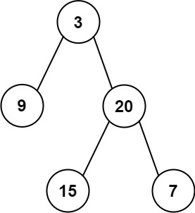

# 106. Construct Binary Tree from Inorder and Postorder Traversal

<!-- markdownlint-disable MD033 -->
<span style="color: #f59e0b;"><strong>Medium</strong></span>
<!-- markdownlint-enable MD033 -->

## Problem

Given two integer arrays inorder and postorder where inorder is the inorder traversal of a binary tree and postorder is the postorder traversal of the same tree, construct and return the binary tree.

### Example 1



```text
Input: inorder = [9,3,15,20,7], postorder = [9,15,7,20,3]
Output: [3,9,20,null,null,15,7]
Explanation: The root of the tree is 3, which is the last value in postorder. Splitting inorder around 3 gives [9] for the left subtree and [15,20,7] for the right subtree.
```

### Example 2

```text
Input: inorder = [-1], postorder = [-1]
Output: [-1]
Explanation: The tree consists of a single node with value -1.
```

### Constraints

- 1 <= inorder.length <= 3000
- postorder.length == inorder.length
- -3000 <= inorder[i], postorder[i] <= 3000
- inorder and postorder consist of unique values.
- Each value of postorder also appears in inorder.
- inorder and postorder are guaranteed to be the traversals of an existing binary tree.

[LeetCode 106. Construct Binary Tree from Inorder and Postorder Traversal](https://leetcode.com/problems/construct-binary-tree-from-inorder-and-postorder-traversal/description/?envType=study-plan-v2&envId=top-interview-150)

## Answer

### 解題思路

`postorder` 的最後一個元素一定是目前子樹的根節點。根節點在 `inorder` 中的位置，會將目前範圍切成左子樹與右子樹：

- `inorder` 根節點左側是左子樹。
- `inorder` 根節點右側是右子樹。

先建立 `inorderIndex`，把每個節點值對應到它在 `inorder` 的索引，讓切分範圍可以在 $O(1)$ 時間完成。接著用 `postorderIndex` 從陣列尾端往前取值。由於反向的 `postorder` 順序是「根、右、左」，所以建立目前根節點後，必須先遞迴建立右子樹，再建立左子樹。

遞迴函式以 `inorderLeft` 和 `inorderRight` 表示目前子樹在 `inorder` 中的閉區間。當 `inorderLeft > inorderRight` 時，代表目前區間沒有節點，回傳 `null`。

### `inorder` 與 `postorder` 的分工

這兩個 traversal 提供的是不同且互補的資訊：

| Traversal | 固定順序 | 建樹時提供的資訊 |
| :--- | :--- | :--- |
| `postorder` | Left -> Right -> Root | 目前子樹的最後一個元素是根節點；反向讀取時順序為 Root -> Right -> Left |
| `inorder` | Left -> Root -> Right | 找到根節點的位置後，左側是左子樹，右側是右子樹 |

以題目範例為例：

```text
inorder   = [9, 3, 15, 20, 7]
postorder = [9, 15, 7, 20, 3]
```

1. `postorder` 的最後一個元素是 `3`，因此 `3` 是整棵樹的根節點。
2. 在 `inorder` 找到 `3` 後，陣列被切成 `[9] 3 [15, 20, 7]`，因此 `[9]` 是左子樹，`[15, 20, 7]` 是右子樹。
3. 反向讀取 `postorder` 後，下一個節點是右子樹的根 `20`，所以程式必須先建立右子樹，再建立左子樹。

因此可以記成：`postorder` 決定「誰是根」，`inorder` 決定「根的左右邊界」。只使用其中一個 traversal，通常無法唯一決定二元樹的結構。

```java
import java.util.HashMap;
import java.util.Map;

class Solution {
    private final Map<Integer, Integer> inorderIndex = new HashMap<>();
    private int postorderIndex;

    public TreeNode buildTree(int[] inorder, int[] postorder) {
        if (inorder.length == 0) {
            return null;
        }

        // 先記錄每個值在 inorder 的位置，才能快速切分左右子樹。
        for (int index = 0; index < inorder.length; index++) {
            inorderIndex.put(inorder[index], index);
        }

        // 從 postorder 尾端開始取值，尾端元素是整棵樹的根節點。
        postorderIndex = postorder.length - 1;
        return buildSubtree(inorder, postorder, 0, inorder.length - 1);
    }

    private TreeNode buildSubtree(
            int[] inorder,
            int[] postorder,
            int inorderLeft,
            int inorderRight) {
        // 閉區間為空，表示目前沒有子樹。
        if (inorderLeft > inorderRight) {
            return null;
        }

        int rootValue = postorder[postorderIndex--];
        TreeNode root = new TreeNode(rootValue);
        int rootIndex = inorderIndex.get(rootValue);

        // 反向 postorder 的順序是根、右、左，因此必須先建立右子樹。
        root.right = buildSubtree(inorder, postorder, rootIndex + 1, inorderRight);
        root.left = buildSubtree(inorder, postorder, inorderLeft, rootIndex - 1);

        return root;
    }
}
```

### 邊界條件

- `inorder` 為空陣列時沒有根節點，直接回傳 `null`。
- 只有一個元素時，該元素同時是根節點，左右遞迴範圍都為空。
- `inorder` 與 `postorder` 的值都不重複，因此可以安全地用 `HashMap` 找到根節點位置。
- 完全傾斜的樹仍能正確建立，但遞迴深度會等於節點數。

### 複雜度分析

令 `n` 為二元樹中的節點數，`h` 為樹高。

- 時間複雜度：$O(n)$。建立索引表會造訪 `inorder` 一次；每個節點只會從 `postorder` 取出一次，且透過 `HashMap` 在 $O(1)$ 時間找到其 `inorder` 位置。
- 空間複雜度：$O(n)$。`HashMap` 儲存 `n` 個索引，遞迴呼叫堆疊額外使用 $O(h)$；合計為 $O(n + h) = O(n)$，其中最差情況是完全傾斜的樹。
