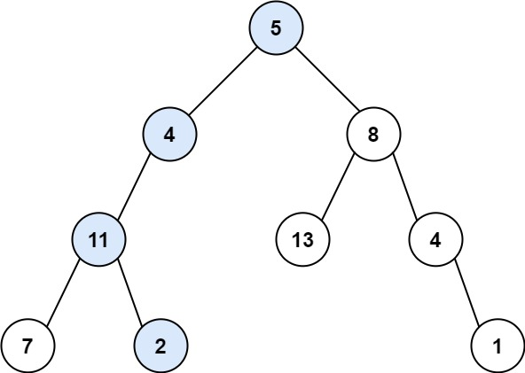
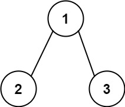

# 112. Path Sum

## Problem

<!-- markdownlint-disable MD033 -->
<span style="color: #16a34a;"><strong>Easy</strong></span>
<!-- markdownlint-enable MD033 -->

Given the root of a binary tree and an integer `targetSum`, return `true` if the tree has a root-to-leaf path such that adding up all the values along the path equals `targetSum`.

A leaf is a node with no children.

### Example 1



```text
Input: root = [5,4,8,11,null,13,4,7,2,null,null,null,1], targetSum = 22
Output: true
Explanation: The root-to-leaf path with the target sum is shown.
```

### Example 2



```text
Input: root = [1,2,3], targetSum = 5
Output: false
Explanation: There are two root-to-leaf paths in the tree:
(1 --> 2): The sum is 3.
(1 --> 3): The sum is 4.
There is no root-to-leaf path with sum = 5.
```

### Example 3

```text
Input: root = [], targetSum = 0
Output: false
Explanation: Since the tree is empty, there are no root-to-leaf paths.
```

### Constraints

- The number of nodes in the tree is in the range [0, 5000].
- -1000 <= Node.val <= 1000
- -1000 <= targetSum <= 1000

[LeetCode 112. Path Sum](https://leetcode.com/problems/path-sum/description/?envType=study-plan-v2&envId=top-interview-150)

## Answer

### 解題思路

使用深度優先搜尋（DFS）沿著每條根節點到葉節點的路徑前進。每到一個節點，就從 `targetSum` 扣除目前節點的值，將「還需要湊出的總和」傳給下一層。

只有走到葉節點時，才檢查剩餘總和是否為 `0`。若目前節點不是葉節點，則繼續搜尋左右子樹；任一子樹找到符合條件的路徑，就可以回傳 `true`。空樹沒有根到葉路徑，因此回傳 `false`。

節點值可能是負數，所以不能因為目前剩餘總和小於 `0` 就提早停止；後續節點仍可能使總和符合目標。

```java
class Solution {
    public boolean hasPathSum(TreeNode root, int targetSum) {
        // 空樹不存在根到葉路徑。
        if (root == null) {
            return false;
        }

        // 扣除目前節點的值，將剩餘目標傳入子樹。
        int remainingSum = targetSum - root.val;

        // 只有葉節點才算路徑終點，並在此確認總和是否剛好符合目標。
        if (root.left == null && root.right == null) {
            return remainingSum == 0;
        }

        // 左右子樹任一條根到葉路徑符合條件即可。
        return hasPathSum(root.left, remainingSum)
                || hasPathSum(root.right, remainingSum);
    }
}
```

### 邊界條件

- `root == null`：空樹沒有任何根到葉路徑，回傳 `false`。
- 只有根節點：根同時也是葉節點，直接比較 `root.val` 是否等於 `targetSum`。
- 節點值為負數：持續搜尋到葉節點，不以剩餘總和的正負提早剪枝。
- 目標總和在內部節點就已符合，但該節點不是葉節點：仍需繼續往下，不能將不完整路徑當成答案。

### 複雜度分析

令 `n` 為節點數，`h` 為樹高。

- 時間複雜度：$O(n)$，最差情況會造訪每個節點一次。
- 空間複雜度：$O(h)$，來自遞迴呼叫堆疊；平衡樹為 $O(\log n)$，最差的傾斜樹為 $O(n)$。
