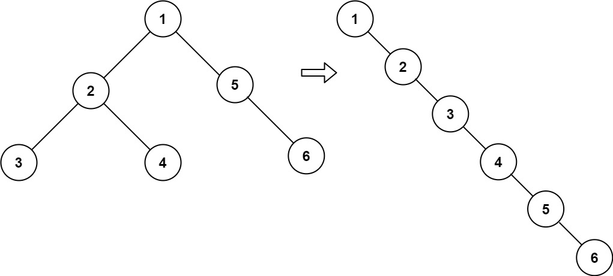

# 114. Flatten Binary Tree to Linked List

## Problem

<!-- markdownlint-disable MD033 -->
<span style="color: #f59e0b;"><strong>Medium</strong></span>
<!-- markdownlint-enable MD033 -->

Given the root of a binary tree, flatten the tree into a "linked list":

The "linked list" should use the same TreeNode class where the right child pointer points to the next node in the list and the left child pointer is always null.
The "linked list" should be in the same order as a pre-order traversal of the binary tree.

### Example 1



```text
Input: root = [1,2,5,3,4,null,6]
Output: [1,null,2,null,3,null,4,null,5,null,6]
Explanation: The preorder traversal is [1,2,3,4,5,6], and each node points to the next through its right child.
```

### Example 2

```text
Input: root = []
Output: []
Explanation: The tree is empty, so the flattened list is empty.
```

### Example 3

```text
Input: root = [0]
Output: [0]
Explanation: A single-node tree is already flattened.
```

### Constraints

- The number of nodes in the tree is in the range [0, 2000].
- -100 <= Node.val <= 100

Follow up: Can you flatten the tree in-place (with O(1) extra space)?

[LeetCode 114. Flatten Binary Tree to Linked List](https://leetcode.com/problems/flatten-binary-tree-to-linked-list/description/?envType=study-plan-v2&envId=top-interview-150)

## Answer

### 解題思路

依照前序遍歷，節點順序是「目前節點、左子樹、右子樹」。因此，當目前節點有左子樹時，將左子樹接到目前節點的 `right`，並把原本的右子樹接到左子樹最右側的位置；再將目前節點的 `left` 設為 `null`。如此一來，沿著 `right` 往下處理就會依前序順序走訪整棵樹。

每次從目前節點的左子樹開始，沿 `right` 指標找到最右側的節點，將目前節點原有的右子樹接到該節點後方。接著把左子樹移到右側並清空左指標。迴圈再往 `current.right` 前進，持續處理尚未展平的左子樹。

此作法直接重接原有節點，不建立新節點，也不使用遞迴或額外集合。

```java
class Solution {
    public void flatten(TreeNode root) {
        TreeNode current = root;

        while (current != null) {
            if (current.left != null) {
                // 找到左子樹中沿 right 指標最右側的節點。
                TreeNode predecessor = current.left;
                while (predecessor.right != null) {
                    predecessor = predecessor.right;
                }

                // 保留原右子樹，接到左子樹後方，再把左子樹移到 right。
                predecessor.right = current.right;
                current.right = current.left;
                current.left = null;
            }

            // right 現在是前序順序中的下一段，繼續原地展平。
            current = current.right;
        }
    }
}
```

### 邊界條件

- `root == null`：迴圈不會執行，空樹維持不變。
- 只有一個節點：左右子樹皆為 `null`，不需修改。
- 只有左子樹或只有右子樹：每次重接後都將 `left` 設為 `null`，並繼續處理右側鏈結。

### 複雜度分析

令 `n` 為二元樹中的節點數。

- 時間複雜度：$O(n)$，每個節點都會沿展平後的 `right` 鏈結處理；尋找左子樹最右節點的掃描總量也是線性的。
- 空間複雜度：$O(1)$，只使用固定數量的節點參考，並在原樹上重接指標。
