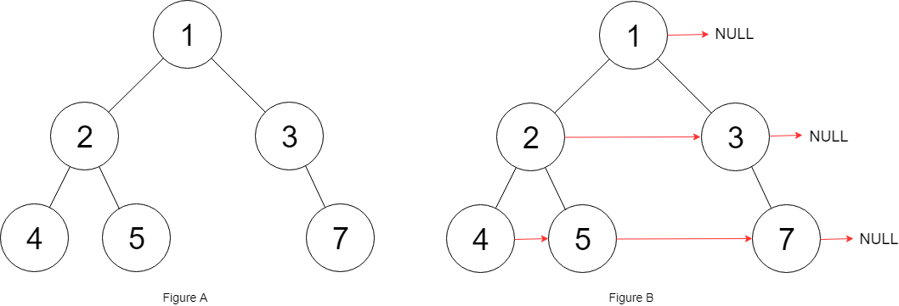

# 117. Populating Next Right Pointers in Each Node II

## Problem

<span style="color: #f59e0b;"><strong>Medium</strong></span>

Given a binary tree:

```text
struct Node {
  int val;
  Node *left;
  Node *right;
  Node *next;
}
```

Populate each next pointer to point to its next right node. If there is no next right node, the next pointer should be set to NULL.

Initially, all next pointers are set to NULL.

### Example 1



```text
Input: root = [1,2,3,4,5,null,7]
Output: [1,#,2,3,#,4,5,7,#]
Explanation: Given the above binary tree (Figure A), your function should populate each next pointer to point to its next right node, just like in Figure B. The serialized output is in level order as connected by the next pointers, with '#' signifying the end of each level.
```

### Example 2

```text
Input: root = []
Output: []
```

### Constraints

- The number of nodes in the tree is in the range [0, 6000].
- -100 <= Node.val <= 100

### Follow-up

You may only use constant extra space.
The recursive approach is fine. You may assume implicit stack space does not count as extra space for this problem.

https://leetcode.com/problems/populating-next-right-pointers-in-each-node-ii/description/?envType=study-plan-v2&envId=top-interview-150

## Answer

### 解題思路

使用目前層已建立好的 `next` 指標，從左至右走訪該層，並依序把每個節點的左子節點、右子節點接到下一層的串列尾端。每層建立一個虛擬頭節點 `dummy`，讓第一個子節點也能用相同方式接上；`tail` 則始終指向下一層串列的尾端。

即使樹是不完整的，只要略過不存在的子節點，依照目前層由左至右的順序串接，就能正確建立下一層。每輪結束後將尾端的 `next` 設為 `null`，再從 `dummy.next` 開始處理下一層。若 `root` 為 `null`，直接回傳即可。

```java
class Solution {
    public Node connect(Node root) {
        if (root == null) {
            return null;
        }

        Node levelStart = root;
        while (levelStart != null) {
            // dummy.next 是下一層的起點，tail 維護下一層串列的尾端。
            Node dummy = new Node(0);
            Node tail = dummy;

            // 沿著目前層的 next 指標走訪，並依左、右順序收集子節點。
            Node current = levelStart;
            while (current != null) {
                if (current.left != null) {
                    tail.next = current.left;
                    tail = tail.next;
                }
                if (current.right != null) {
                    tail.next = current.right;
                    tail = tail.next;
                }
                current = current.next;
            }

            // 明確終止下一層串列，並移至下一層的第一個節點。
            tail.next = null;
            levelStart = dummy.next;
        }

        return root;
    }
}
```

### 說明

1. `next` 指標串起目前層，因此不需要佇列；`dummy` 與 `tail` 只用來就地建立下一層的連結。
2. 左子節點先於右子節點加入，且目前層由左至右走訪，所以即使中間有缺少的子節點，下一層順序仍正確。
3. 節點數為 `n`。每個節點只會被走訪一次，時間複雜度為 `O(n)`；額外空間複雜度為 `O(1)`。
