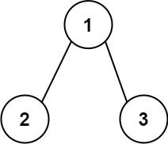
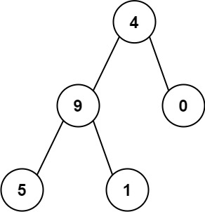

# 129. Sum Root to Leaf Numbers

## Problem

<!-- markdownlint-disable MD033 -->
<span style="color: #f59e0b;"><strong>Medium</strong></span>
<!-- markdownlint-enable MD033 -->

You are given the root of a binary tree containing digits from 0 to 9 only.

Each root-to-leaf path in the tree represents a number.

For example, the root-to-leaf path 1 -> 2 -> 3 represents the number 123.
Return the total sum of all root-to-leaf numbers. Test cases are generated so that the answer will fit in a 32-bit integer.

A leaf node is a node with no children.

### Example 1



```text
Input: root = [1,2,3]
Output: 25
Explanation:
The root-to-leaf path 1->2 represents the number 12.
The root-to-leaf path 1->3 represents the number 13.
Therefore, sum = 12 + 13 = 25.
```

### Example 2



```text
Input: root = [4,9,0,5,1]
Output: 1026
Explanation:
The root-to-leaf path 4->9->5 represents the number 495.
The root-to-leaf path 4->9->1 represents the number 491.
The root-to-leaf path 4->0 represents the number 40.
Therefore, sum = 495 + 491 + 40 = 1026.
```

### Constraints

- The number of nodes in the tree is in the range [1, 1000].
- 0 <= Node.val <= 9
- The depth of the tree will not exceed 10.

[LeetCode 129. Sum Root to Leaf Numbers](https://leetcode.com/problems/sum-root-to-leaf-numbers/description/?envType=study-plan-v2&envId=top-interview-150)

## Answer

### 解題思路

使用深度優先搜尋（DFS）走訪每條根節點到葉節點的路徑，並以 `currentNumber` 記錄目前路徑已組成的數字。每到一個節點，就將數字左移一位（乘以 10），再加上目前節點的數字：`currentNumber * 10 + node.val`。

抵達葉節點時，完整的根到葉路徑已組成一個數字，將它回傳作為這個子樹的總和。非葉節點則分別遞迴計算左右子樹，並把兩邊的結果相加。空節點回傳 `0`，因此缺少的子樹不會增加總和，空樹也會自然得到 `0`。

```java
class Solution {
    public int sumNumbers(TreeNode root) {
        return dfs(root, 0);
    }

    // currentNumber 是從根節點走到目前節點之前，已組成的路徑數字。
    private int dfs(TreeNode node, int currentNumber) {
        // 空節點沒有根到葉路徑，對總和貢獻 0。
        if (node == null) {
            return 0;
        }

        // 將目前節點的數字接到路徑末端，形成新的路徑數字。
        int pathNumber = currentNumber * 10 + node.val;

        // 只有葉節點代表一條完整路徑，回傳該路徑代表的數字。
        if (node.left == null && node.right == null) {
            return pathNumber;
        }

        // 左右子樹各自累加其根到葉路徑的數字。
        return dfs(node.left, pathNumber) + dfs(node.right, pathNumber);
    }
}
```

### 說明

1. 只有在葉節點才回傳路徑數字，確保每個加總項目都是完整的根到葉路徑。
2. 節點值介於 `0` 到 `9`，所以乘以 `10` 再加上節點值，正好是在目前數字尾端追加一位；單邊缺少的子樹由 `null` 判斷回傳 `0`。
3. 題目保證樹深不超過 `10`，且答案能放入 32 位元整數；路徑累積與總和使用 `int` 即可。
4. 時間複雜度：$O(n)$，每個節點只走訪一次。空間複雜度：$O(h)$，來自遞迴呼叫堆疊；`n` 為節點數，`h` 為樹高（最差情況下 `h = n`）。
