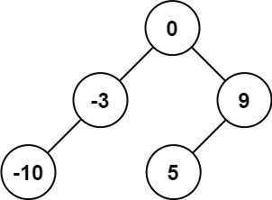
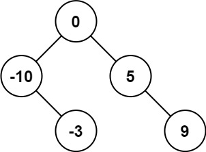
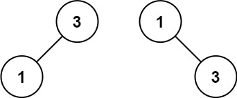

# 108. Convert Sorted Array to Binary Search Tree

## Problem

<span style="color: #16a34a;"><strong>Easy</strong></span>

給定一個以遞增順序排序的整數陣列 `nums`，請將它轉換成一棵高度平衡的二元搜尋樹。

高度平衡的二元搜尋樹是指每個節點的左右子樹高度差最多為 1。

### Example 1

```text
輸入：nums = [-10,-3,0,5,9]
輸出：[0,-3,9,-10,null,5]
說明：[0,-10,5,null,-3,null,9] 也符合要求。
```



### Example 2

```text
輸入：nums = [1,3]
輸出：[3,1]
說明：[1,null,3] 與 [3,1] 都是高度平衡的二元搜尋樹。
```





[LeetCode 題目連結](https://leetcode.com/problems/convert-sorted-array-to-binary-search-tree/)

## Answer

由於陣列已經按照遞增順序排列，若選取區間中間的元素作為根節點：

1. 中間元素左側的所有元素都小於根節點，適合建立左子樹。
2. 中間元素右側的所有元素都大於根節點，適合建立右子樹。
3. 對左右兩個區間重複相同流程，就能建立高度平衡的二元搜尋樹。

使用 `left > right` 作為遞迴終止條件，代表目前區間沒有元素。中間索引使用 `left + (right - left) / 2`，避免 `left + right` 可能造成整數溢位。

```java
/**
 * Definition for a binary tree node.
 * public class TreeNode {
 *     int val;
 *     TreeNode left;
 *     TreeNode right;
 *     TreeNode() {}
 *     TreeNode(int val) { this.val = val; }
 *     TreeNode(int val, TreeNode left, TreeNode right) {
 *         this.val = val;
 *         this.left = left;
 *         this.right = right;
 *     }
 * }
 */
class Solution {
    public TreeNode sortedArrayToBST(int[] nums) {
        return build(nums, 0, nums.length - 1);
    }

    private TreeNode build(int[] nums, int left, int right) {
        // 區間為空時，建立空子樹。
        if (left > right) {
            return null;
        }

        // 選取中間元素，讓左右子樹的節點數量盡量接近。
        int middle = left + (right - left) / 2;
        TreeNode root = new TreeNode(nums[middle]);

        // 遞迴建立左、右子樹，分別使用中間元素兩側的區間。
        root.left = build(nums, left, middle - 1);
        root.right = build(nums, middle + 1, right);
        return root;
    }
}
```

### 說明

- 時間複雜度：`O(n)`，每個陣列元素都會被處理一次。
- 空間複雜度：`O(log n)`，遞迴呼叫堆疊的深度等於平衡樹的高度。
