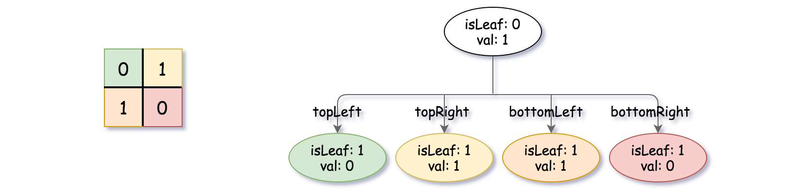
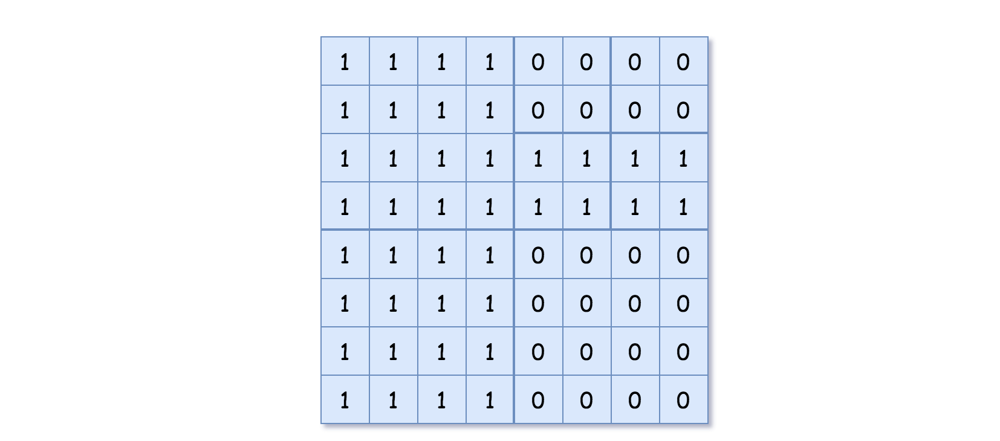
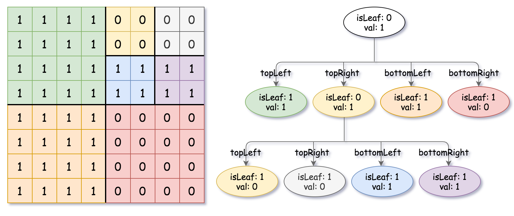

# 427. Construct Quad Tree

## Problem

<span style="color: #f59e0b;"><strong>Medium</strong></span>

Given a `n * n` matrix `grid` of `0`'s and `1`'s only. We want to represent `grid` with a Quad-Tree.

Return the root of the Quad-Tree representing `grid`.

A Quad-Tree is a tree data structure in which each internal node has exactly four children. Besides, each node has two attributes:

- `val`: True if the node represents a grid of `1`'s or False if the node represents a grid of `0`'s. Notice that you can assign the `val` to True or False when `isLeaf` is False, and both are accepted in the answer.
- `isLeaf`: True if the node is a leaf node on the tree or False if the node has four children.

```java
class Node {
    public boolean val;
    public boolean isLeaf;
    public Node topLeft;
    public Node topRight;
    public Node bottomLeft;
    public Node bottomRight;
}
```

We can construct a Quad-Tree from a two-dimensional area using the following steps:

1. If the current grid has the same value (i.e all `1`'s or all `0`'s) set `isLeaf` True and set `val` to the value of the grid and set the four children to Null and stop.
2. If the current grid has different values, set `isLeaf` to False and set `val` to any value and divide the current grid into four sub-grids as shown in the photo.
3. Recurse for each of the children with the proper sub-grid.


If you want to know more about the Quad-Tree, you can refer to the wiki.

Quad-Tree format:

You don't need to read this section for solving the problem. This is only if you want to understand the output format here. The output represents the serialized format of a Quad-Tree using level order traversal, where null signifies a path terminator where no node exists below.

It is very similar to the serialization of the binary tree. The only difference is that the node is represented as a list `[isLeaf, val]`.

If the value of `isLeaf` or `val` is True we represent it as `1` in the list `[isLeaf, val]` and if the value of `isLeaf` or `val` is False we represent it as `0`.

### Example 1


```text
Input: grid = [[0,1],[1,0]]
Output: [[0,1],[1,0],[1,1],[1,1],[1,0]]
Explanation: The explanation of this example is shown below:
Notice that 0 represents False and 1 represents True in the photo representing the Quad-Tree.
```



### Example 2



```text
Input: grid = [[1,1,1,1,0,0,0,0],[1,1,1,1,0,0,0,0],[1,1,1,1,1,1,1,1],[1,1,1,1,1,1,1,1],[1,1,1,1,0,0,0,0],[1,1,1,1,0,0,0,0],[1,1,1,1,0,0,0,0],[1,1,1,1,0,0,0,0]]
Output: [[0,1],[1,1],[0,1],[1,1],[1,0],null,null,null,null,[1,0],[1,0],[1,1],[1,1]]
Explanation: All values in the grid are not the same. We divide the grid into four sub-grids.
The topLeft, bottomLeft and bottomRight each has the same value.
The topRight have different values so we divide it into 4 sub-grids where each has the same value.
Explanation is shown in the photo below:
```



### Constraints

```text
n == grid.length == grid[i].length
n == 2^x where 0 <= x <= 6
```

[LeetCode 427. Construct Quad Tree](https://leetcode.com/problems/construct-quad-tree/)

## Answer

### 解題思路

這題可以直接用 divide and conquer。每次處理一個正方形區域，先檢查這個區域內的值是否全部相同：

1. 如果全部相同，這個區域可以壓縮成一個 leaf node，`val` 就是該區域的值。
2. 如果出現不同值，這個區域不能再壓縮，必須建立一個 internal node，並把邊長切半後遞迴建立左上、右上、左下、右下四個子區域。
3. 當區域大小是 `1 x 1` 時，一定是 leaf node，這也會自然被「全部相同」的判斷處理掉。

遞迴函式使用 `(row, column, size)` 表示目前處理的正方形左上角座標與邊長。因為題目保證 `n` 是 2 的次方，所以每次 `size / 2` 都能剛好切成四個大小相同的子正方形。

需要特別注意的是，internal node 的 `val` 可以任意設定。因為 `isLeaf == false` 時，這個 node 只代表「目前區域被切成四個子區域」，真正的 `0` 或 `1` 內容要往四個 child 繼續看；只有 `isLeaf == true` 的 leaf node，其 `val` 才代表整塊區域的值。所以建立 internal node 時使用 `new Node(true, false, ...)` 或 `new Node(false, false, ...)` 都可以通過，重點是 `isLeaf` 必須是 `false` 並且四個 child 都正確建立。

```java
/*
// Definition for a QuadTree node.
class Node {
    public boolean val;
    public boolean isLeaf;
    public Node topLeft;
    public Node topRight;
    public Node bottomLeft;
    public Node bottomRight;

    public Node() {}

    public Node(boolean _val, boolean _isLeaf) {
        val = _val;
        isLeaf = _isLeaf;
    }

    public Node(boolean _val, boolean _isLeaf, Node _topLeft, Node _topRight, Node _bottomLeft, Node _bottomRight) {
        val = _val;
        isLeaf = _isLeaf;
        topLeft = _topLeft;
        topRight = _topRight;
        bottomLeft = _bottomLeft;
        bottomRight = _bottomRight;
    }
}
*/
class Solution {
    public Node construct(int[][] grid) {
        return build(grid, 0, 0, grid.length);
    }

    private Node build(int[][] grid, int row, int column, int size) {
        // 若整個區域的值相同，就直接壓縮成 leaf node。
        if (hasSameValue(grid, row, column, size)) {
            return new Node(grid[row][column] == 1, true);
        }

        // 否則把目前正方形切成四個象限，分別建立四個子節點。
        int halfSize = size / 2;
        Node topLeft = build(grid, row, column, halfSize);
        Node topRight = build(grid, row, column + halfSize, halfSize);
        Node bottomLeft = build(grid, row + halfSize, column, halfSize);
        Node bottomRight = build(grid, row + halfSize, column + halfSize, halfSize);

        // internal node 的 val 不代表區域值；答案會繼續看四個 child，所以可任意設定。
        return new Node(true, false, topLeft, topRight, bottomLeft, bottomRight);
    }

    private boolean hasSameValue(int[][] grid, int row, int column, int size) {
        int target = grid[row][column];

        // 掃描目前區域，確認是否存在和左上角不同的值。
        for (int currentRow = row; currentRow < row + size; currentRow++) {
            for (int currentColumn = column; currentColumn < column + size; currentColumn++) {
                if (grid[currentRow][currentColumn] != target) {
                    return false;
                }
            }
        }

        return true;
    }
}
```

### 說明

- 邊界條件：`n` 最小可以是 `1`，此時整個 grid 會直接成為一個 leaf node。
- 關鍵判斷：只要目前區域全部相同，就不需要繼續切分；一旦有不同值，才建立四個子節點。
- 時間複雜度：`O(n^2 log n)`，其中 `n` 是 grid 的邊長。最壞情況下，每一層切分都可能掃描所有格子一次，總共有 `log n` 層。
- 空間複雜度：`O(log n)`，不計輸出的 Quad-Tree 節點時，遞迴呼叫堆疊深度為 `log n`；若計入輸出樹，最壞情況會有 `O(n^2)` 個節點。