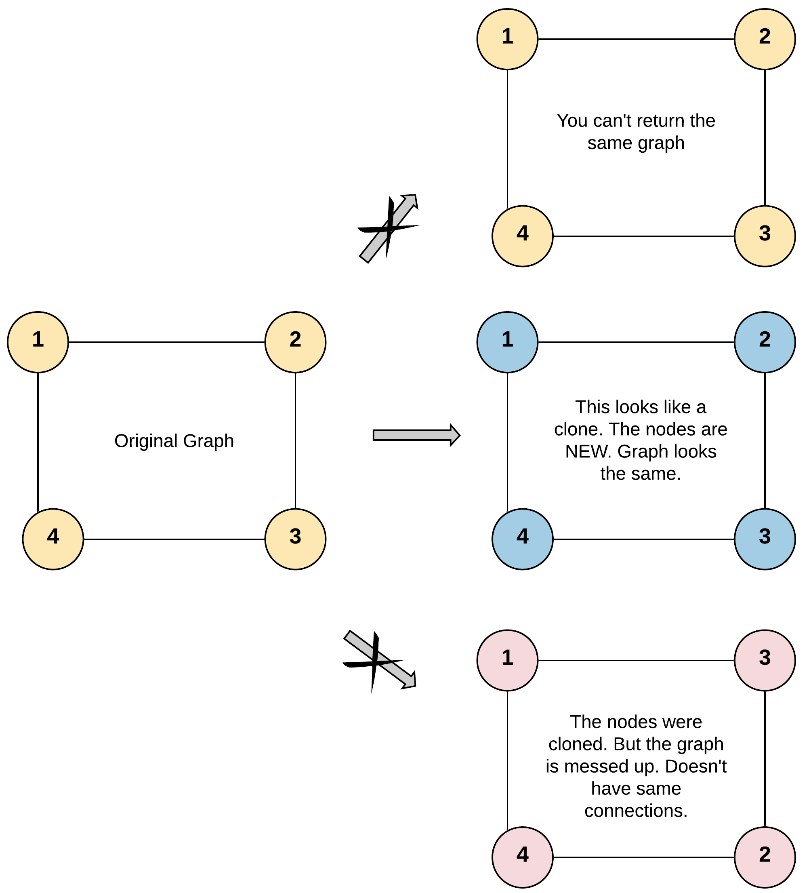
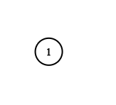

# 133. Clone Graph

## Problem

<span style="color: #f59e0b;"><strong>Medium</strong></span>

Given a reference of a node in a **connected** undirected graph.

Return a **deep copy** (clone) of the graph.

Each node in the graph contains a value (`int`) and a list (`List[Node]`) of its neighbors.

```java
class Node {
    public int val;
    public List<Node> neighbors;
}
```

**Test case format:**

For simplicity, each node's value is the same as the node's index (1-indexed). For example, the first node with `val == 1`, the second node with `val == 2`, and so on. The graph is represented in the test case using an adjacency list.

An adjacency list is a collection of unordered lists used to represent a finite graph. Each list describes the set of neighbors of a node in the graph.

The given node will always be the first node with `val = 1`. You must return the **copy of the given node** as a reference to the cloned graph.

### Example 1



```text
Input: adjList = [[2,4],[1,3],[2,4],[1,3]]
Output: [[2,4],[1,3],[2,4],[1,3]]
Explanation: There are 4 nodes in the graph.
1st node (val = 1)'s neighbors are 2nd node (val = 2) and 4th node (val = 4).
2nd node (val = 2)'s neighbors are 1st node (val = 1) and 3rd node (val = 3).
3rd node (val = 3)'s neighbors are 2nd node (val = 2) and 4th node (val = 4).
4th node (val = 4)'s neighbors are 1st node (val = 1) and 3rd node (val = 3).
```

### Example 2



```text
Input: adjList = [[]]
Output: [[]]
Explanation: Note that the input contains one empty list. The graph consists of only one node with val = 1 and it does not have any neighbors.
```

### Example 3

```text
Input: adjList = []
Output: []
Explanation: This an empty graph, it does not have any nodes.
```

**Constraints:**

- The number of nodes in the graph is in the range `[0, 100]`.
- `1 <= Node.val <= 100`
- `Node.val` is unique for each node.
- There are no repeated edges and no self-loops in the graph.
- The Graph is connected and all nodes can be visited starting from the given node.

<https://leetcode.com/problems/clone-graph/>

## Answer

### 解題思路

深拷貝圖的難點在於「環」與「重複邊」：如果直接對每個鄰居遞迴複製，會在環上無限循環。

關鍵觀察是：**每個原始節點只能對應到唯一一個複製節點**。因此只要維護一張 `原始節點 -> 複製節點` 的對應表（`HashMap`），它就同時扮演兩個角色：

1. **對應表**：查表取得已建立的複製節點，讓不同路徑指向同一份複製，維持原圖的共用結構。
2. **走訪標記**：只要某個原始節點已在表中，代表它已被建立並排入處理，不需要再走訪一次，因此環不會造成無限迴圈。

流程採用 BFS：

- 若 `node` 為 `null`（空圖），直接回傳 `null`。
- 先建立起點的複製節點並放入 map，再把**原始起點**推入 queue。
- 每次取出一個原始節點，走訪它的鄰居；沒有複製過的鄰居先建立複製並入隊，接著不論是否為新建，都把該鄰居的複製節點接到目前節點複製的 `neighbors` 上。
- 無向圖的每條邊會從兩個端點各處理一次，因此最終每個複製節點的鄰居列表會與原節點一致。

注意：複製節點的 `neighbors` 必須在節點出隊時才填入，不能在建立節點時填，否則會參照到尚未建立的複製節點。

### 為什麼除了 map 還需要 queue？

因為複製一個節點分成兩個階段：

1. `new Node(val)`：建出空殼（`neighbors` 還是空的）。
2. 填 `neighbors`：必須等所有鄰居的空殼都存在才能做。

`map` 只記錄「階段 1 已完成」，回答的是「這個原始節點的複製品是誰」；它不知道誰還卡在階段 2。`queue` 才是那份「待辦清單」：記錄哪些節點的鄰居還沒接線。沒有它，迴圈沒有依據決定下一個要處理誰，只會複製到起點一個節點。（也不能改成邊走 `map.keySet()` 邊 `put`，會拋 `ConcurrentModificationException`。）

不過顯式的 queue 確實可以省掉：改用遞迴 DFS，就是讓 call stack 來當這份待辦清單（見下方延伸寫法）。結論是：**map（去重與身份對應）加上某種待辦結構**，兩者缺一不可。

```java
import java.util.ArrayDeque;
import java.util.HashMap;
import java.util.Map;
import java.util.Queue;

class Solution {
    /**
     * 回傳連通無向圖的深拷貝。
     *
     * @param node 原圖中的起點節點（測資保證為 val = 1 的節點），空圖時為 null
     * @return 複製圖中對應 node 的節點
     */
    public Node cloneGraph(Node node) {
        // 邊界條件：空圖沒有任何節點可複製。
        if (node == null) {
            return null;
        }

        // cloned 同時是「原始節點 -> 複製節點」對應表與已走訪標記，
        // 有了它才能在遇到環或重複走到的節點時重用同一份複製節點。
        Map<Node, Node> cloned = new HashMap<>();

        // 先建立起點的複製節點（此時 neighbors 仍為空，稍後出隊時才填）。
        cloned.put(node, new Node(node.val));

        // queue 儲存「原始節點」，代表其複製節點的鄰居列表尚未填寫。
        Queue<Node> queue = new ArrayDeque<>();
        queue.offer(node);

        while (!queue.isEmpty()) {
            Node current = queue.poll();
            Node currentCopy = cloned.get(current);

            for (Node neighbor : current.neighbors) {
                if (!cloned.containsKey(neighbor)) {
                    // put 同時代表「已拜訪」，避免環上的節點被重複加入 queue。
                    cloned.put(neighbor, new Node(neighbor.val));
                    // 新節點的鄰居還沒接線，排入待辦清單。
                    queue.offer(neighbor);
                }

                // 這行在 if 外：不論鄰居是新建立或早已存在，這條邊都要接到複製圖上，
                // 這樣才能還原原圖的共用結構與環。
                currentCopy.neighbors.add(cloned.get(neighbor));
            }
        }

        return cloned.get(node);
    }
}
```

### 說明

設 `n` 為圖中的節點數、`e` 為邊數。

1. **關鍵判斷**：`cloned.containsKey(neighbor)` 決定是否需要新建複製節點並入隊；因為每個節點只會入隊一次，走訪必定終止。
2. **邊界條件**：
   - `node == null`（空圖 `adjList = []`）：直接回傳 `null`。
   - 單一節點且無鄰居（`adjList = [[]]`）：queue 只處理一次，回傳一個 `neighbors` 為空的節點。
   - 題目保證沒有自環與重複邊，且圖為連通，因此從給定節點出發即可走訪所有節點。
3. **時間複雜度**：`O(n + e)`。每個節點恰好入隊與出隊一次，每條邊在兩個端點各被檢查一次，`HashMap` 的查詢與插入平均為 `O(1)`。
4. **空間複雜度**：`O(n)`。`cloned` 儲存 `n` 組對應關係，queue 最多同時存放 `O(n)` 個節點；複製圖本身的 `O(n + e)` 屬於必要輸出，不計入額外空間。

### 延伸：DFS 寫法

掉 queue，改由 call stack 當待辦清單，複雜度相同；缺點是鐵鐵形圖時遞迴深度可達 `O(n)`。

```java
import java.util.HashMap;
import java.util.Map;

class Solution {
    private final Map<Node, Node> cloned = new HashMap<>();

    public Node cloneGraph(Node node) {
        if (node == null) {
            return null;
        }

        // 已複製過就直接回傳，這一行同時終止環上的無限遞迴。
        if (cloned.containsKey(node)) {
            return cloned.get(node);
        }

        Node copy = new Node(node.val);

        // 必須「先 put 再遞迴」，否則環會繞回自己而無限展開。
        cloned.put(node, copy);

        for (Node neighbor : node.neighbors) {
            copy.neighbors.add(cloneGraph(neighbor));
        }

        return copy;
    }
}
```