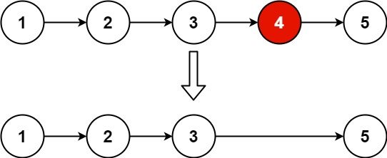

# 019. Remove Nth Node From End of List

## Problem

<span style="color: #f59e0b;"><strong>Medium</strong></span>

Given the head of a linked list, remove the nth node from the end of the list and return its head.

### Example 1



```text
Input: head = [1,2,3,4,5], n = 2
Output: [1,2,3,5]
```

### Example 2

```text
Input: head = [1], n = 1
Output: []
```

### Example 3

```text
Input: head = [1,2], n = 1
Output: [1]
```

### Constraints

- The number of nodes in the list is `sz`.
- `1 <= sz <= 30`
- `0 <= Node.val <= 100`
- `1 <= n <= sz`

Follow up: Could you do this in one pass?

<https://leetcode.com/problems/remove-nth-node-from-end-of-list/description/?envType=study-plan-v2&envId=top-interview-150>

## Answer

使用 dummy node 搭配快慢指標，只需走訪串列一次。先讓 `fast` 從 dummy 往前移動 `n` 步，之後 `fast` 和 `slow` 同步前進；當 `fast` 到達尾端時，`slow` 剛好停在待刪節點的前一個位置。

```java
class Solution {
    public ListNode removeNthFromEnd(ListNode head, int n) {
        ListNode dummy = new ListNode(0, head);
        ListNode fast = dummy;
        ListNode slow = dummy;

        // 先拉開 n 個節點的距離，讓 slow 最後停在待刪節點的前一個位置。
        for (int i = 0; i < n; i++) {
            fast = fast.next;
        }

        // fast 到達尾端時，slow.next 就是從尾端數來第 n 個節點。
        while (fast.next != null) {
            fast = fast.next;
            slow = slow.next;
        }

        // 跳過待刪節點；dummy 也能統一處理刪除原本頭節點的情況。
        slow.next = slow.next.next;
        return dummy.next;
    }
}
```

### 說明

1. `dummy` 放在原本的 `head` 前方，讓刪除頭節點時也能透過前一個節點完成操作。
2. `fast` 先前進 `n` 步，與 `slow` 形成固定距離；兩者同步前進直到 `fast` 位於尾節點。
3. 此時 `slow.next` 是目標節點，將 `slow.next` 改接到 `slow.next.next` 即可移除它。
4. 回傳 `dummy.next`，取得可能已更新的串列頭。

時間複雜度：O(n)  
空間複雜度：O(1)
