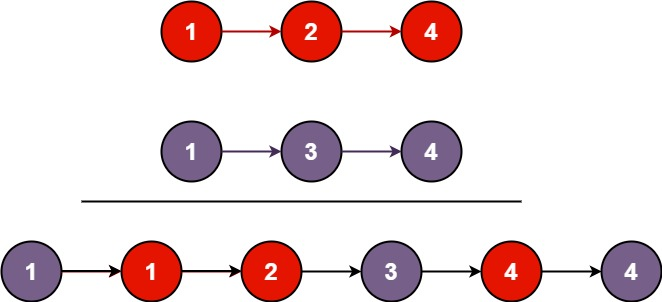

# 21. Merge Two Sorted Lists

## Problem

<span style="color: #16a34a;"><strong>Easy</strong></span>

You are given the heads of two sorted linked lists `list1` and `list2`.

Merge the two lists into one sorted list. The list should be made by splicing together the nodes of the first two lists.

Return the head of the merged linked list.

### Example 1



```text
Input: list1 = [1,2,4], list2 = [1,3,4]
Output: [1,1,2,3,4,4]
Explanation: The linked lists are merged by splicing together the nodes of the first two lists.
```

### Example 2

```text
Input: list1 = [], list2 = []
Output: []
Explanation: Both lists are empty, so the merged list is empty.
```

### Example 3

```text
Input: list1 = [], list2 = [0]
Output: [0]
Explanation: The first list is empty, so the merged list is [0].
```

### Constraints

- The number of nodes in both lists is in the range [0, 50].
- -100 <= Node.val <= 100
- Both `list1` and `list2` are sorted in non-decreasing order.

<https://leetcode.com/problems/merge-two-sorted-lists/description/?envType=study-plan-v2&envId=top-interview-150>

## Answer

### 解題思路

兩條 linked list 都已經按照 non-decreasing order 排序，因此每次只要比較兩個目前節點的值，較小的節點就一定是下一個應放入合併結果的節點。

1. 建立一個虛擬頭節點 `dummy`，讓第一個節點與後續節點都能用相同方式接到結果尾端。
2. 使用 `current` 指向合併結果的最後一個節點；當 `list1` 與 `list2` 都還有節點時，將值較小的節點接到 `current.next`，並向前移動對應的串列指標。
3. 其中一條串列耗盡後，另一條串列剩下的節點已經排序完成，可以直接接到結果尾端。
4. 回傳 `dummy.next`，也就是合併後 linked list 的真正頭節點。此方法直接重新連接原有節點，不需要複製節點。

```java
class Solution {
    public ListNode mergeTwoLists(ListNode list1, ListNode list2) {
        // 虛擬頭節點讓第一個節點與後續節點的接法保持一致。
        ListNode dummy = new ListNode(0);
        ListNode current = dummy;

        // 每次選出兩條尚未合併串列中值較小的目前節點。
        while (list1 != null && list2 != null) {
            if (list1.val <= list2.val) {
                current.next = list1;
                list1 = list1.next;
            } else {
                current.next = list2;
                list2 = list2.next;
            }
            current = current.next;
        }

        // 剩餘串列已排序完成，直接接到合併結果尾端。
        current.next = list1 != null ? list1 : list2;

        return dummy.next;
    }
}
```

### 說明

1. 迴圈每次都將目前兩個候選節點中較小的節點接到結果，因此 `dummy.next` 到 `current` 始終維持排序，且已包含所有已處理節點。
2. 使用 `<=` 時，兩個節點值相等會優先接上 `list1`，不影響排序，也能正確保留重複值。
3. 若其中一個輸入是空串列，迴圈不會執行，另一個串列會由最後一行直接接上；兩個輸入都為空時則回傳 `null`。
4. 設 `n` 為兩條 linked list 的節點總數。每個節點最多被檢查與接上一次，因此時間複雜度為 `O(n)`；除了固定的虛擬頭節點與指標外沒有使用額外資料結構，因此額外空間複雜度為 `O(1)`。
