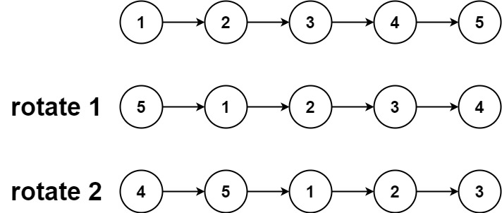
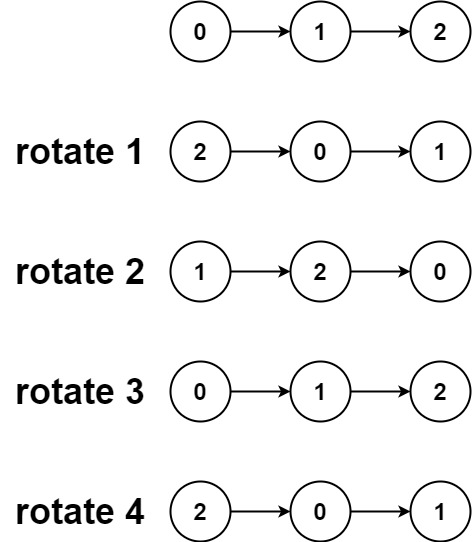

# 061. Rotate List

## Problem

<span style="color: #f59e0b;"><strong>Medium</strong></span>

Given the head of a linked list, rotate the list to the right by k places.

### Example 1



```text
Input: head = [1,2,3,4,5], k = 2
Output: [4,5,1,2,3]
```

### Example 2



```text
Input: head = [0,1,2], k = 4
Output: [2,0,1]
```

### Constraints

The number of nodes in the list is in the range [0, 500].
-100 <= Node.val <= 100
0 <= k <= 2 * 10^9

https://leetcode.com/problems/rotate-list/description/?envType=study-plan-v2&envId=top-interview-150

## Answer

### 解題思路

先走訪串列取得節點數量，並記錄尾節點。向右旋轉 `k` 次，等同於向右旋轉 `k % length` 次，因此可以先用節點數量取餘數，避免重複旋轉。

接著將尾節點連回頭節點，暫時形成環狀鏈結。新的尾節點位於原串列第 `length - k - 1` 個索引位置；找到它後，將它的 `next` 設為 `null`，並回傳下一個節點作為新頭節點。空串列與單節點串列直接回傳即可。

- 時間複雜度：`O(n)`，走訪串列以取得長度，並定位新的尾節點。
- 空間複雜度：`O(1)`，只使用固定數量的指標與整數變數。

```java
class Solution {
    public ListNode rotateRight(ListNode head, int k) {
        if (head == null || head.next == null) {
            return head;
        }

        // 計算串列長度並找到原本的尾節點。
        int length = 1;
        ListNode tail = head;
        while (tail.next != null) {
            tail = tail.next;
            length++;
        }

        // 旋轉整數圈不會改變串列，只需保留餘數。
        int rotations = k % length;
        if (rotations == 0) {
            return head;
        }

        // 暫時將串列接成環，方便從頭節點定位新的尾節點。
        tail.next = head;
        int stepsToNewTail = length - rotations - 1;
        ListNode newTail = head;
        for (int i = 0; i < stepsToNewTail; i++) {
            newTail = newTail.next;
        }

        // 切開環狀鏈結，取得旋轉後的新頭節點。
        ListNode newHead = newTail.next;
        newTail.next = null;
        return newHead;
    }
}
```

### 說明

1. 先計算串列長度，將 `k` 化簡為 `k % length`；若餘數為 `0`，串列不需改變。
2. 將尾節點連回頭節點形成環，再前進 `length - rotations - 1` 步找到新尾節點，切斷它與新頭節點之間的連結。
