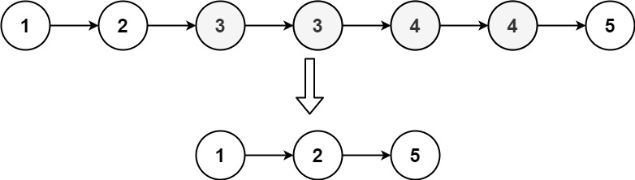
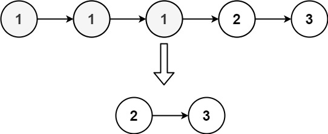

# 082. Remove Duplicates from Sorted List II

## Problem

<span style="color: #f59e0b;"><strong>Medium</strong></span>

You are given the `head` of a sorted linked list.

Delete all nodes that have duplicate numbers, leaving only distinct numbers from the original list.

Return the linked list sorted as well.

### Example 1



```text
Input: head = [1,2,3,3,4,4,5]
Output: [1,2,5]
```

### Example 2



```text
Input: head = [1,1,1,2,3]
Output: [2,3]
```

### Constraints

- The number of nodes in the list is in the range `[0, 300]`.
- `-100 <= Node.val <= 100`
- The list is guaranteed to be sorted in ascending order.

<https://leetcode.com/problems/remove-duplicates-from-sorted-list-ii/description/?envType=study-plan-v2&envId=top-interview-150>

## Answer

### 解題思路

因為 linked list 已排序，相同值的節點會連續出現。使用 `current` 掃描串列，並用 `previous` 指向最後一個確定要保留的節點；若 `current` 所在位置是重複值，就略過該值的整段節點，再將 `previous.next` 接到下一個不同值。若目前值只出現一次，則保留它並讓兩個指標繼續前進。

建立虛擬頭節點 `dummy`，可統一處理重複值從原串列開頭開始的情況。

若串列沒有排序，相同值可能分散在不同位置，就需要用 HashMap 記錄出現次數；這題已排序，相同值必定相鄰，因此只比較相鄰節點並一次跳過整段重複值即可，不需要額外的 HashMap。

```java
class Solution {
    public ListNode deleteDuplicates(ListNode head) {
        // dummy 讓刪除原串列開頭的重複節點時，也能透過前一節點重新接鏈結。
        ListNode dummy = new ListNode(0);
        dummy.next = head;
        ListNode previous = dummy;
        ListNode current = head;

        // 逐段檢查相同值的連續節點，確保重複值全部移除。
        while (current != null) {
            if (current.next != null && current.val == current.next.val) {
                int duplicateValue = current.val;

                // 跳過這個重複值的所有節點，直到遇到不同值或串列結尾。
                while (current != null && current.val == duplicateValue) {
                    current = current.next;
                }

                // 將最後一個確定保留的節點接到下一個尚未處理的節點。
                previous.next = current;
            } else {
                // 目前值只出現一次，保留此節點並同步推進指標。
                previous = current;
                current = current.next;
            }
        }

        return dummy.next;
    }
}
```

### 說明

1. 排序性質保證相同值的節點連續出現，所以透過比較相鄰節點即可判斷重複，不必建立 HashMap；`previous` 始終指向已確認保留部分的最後一個節點，`current` 指向尚未處理的節點。
2. 當相鄰節點值相同時，記錄該值並跳過所有相同節點，再由 `previous.next` 連接到下一個不同值。`previous` 不前進，因為它仍是保留區段的尾端。
3. 當目前節點沒有重複時，將 `previous` 和 `current` 一起向前移動，保留該節點。
4. 設 `n` 為節點數。每個節點最多被走訪一次，因此時間複雜度為 `O(n)`；只使用固定數量的指標，因此額外空間複雜度為 `O(1)`。
