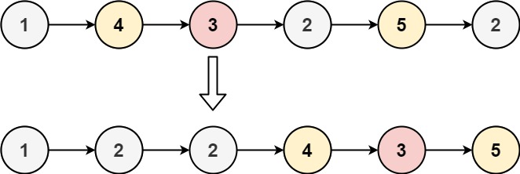

# 086. Partition List

## Problem

<span style="color: #f59e0b;"><strong>Medium</strong></span>

Given the head of a linked list and a value x, partition it such that all nodes less than x come before nodes greater than or equal to x.

You should preserve the original relative order of the nodes in each of the two partitions.

### Example 1



```text
Input: head = [1,4,3,2,5,2], x = 3
Output: [1,2,2,4,3,5]
```

### Example 2

```text
Input: head = [2,1], x = 2
Output: [1,2]
```

### Constraints

- The number of nodes in the list is in the range [0, 200].
- -100 <= Node.val <= 100
- -200 <= x <= 200

https://leetcode.com/problems/partition-list/description/?envType=study-plan-v2&envId=top-interview-150

## Answer

### 解題思路

建立兩條暫存串列：一條收集所有小於 `x` 的節點，另一條收集大於或等於 `x` 的節點。依照原串列順序逐一接上節點，因此兩個分區都能維持原有相對順序。

每次處理節點時，先記住它原本的下一個節點，再將目前節點的 `next` 設為 `null`，避免舊鏈結把兩個分區重新串在一起。走訪完成後，把大於或等於 `x` 的串列接到小於 `x` 的串列尾端，回傳小於 `x` 串列的虛擬頭節點之後的第一個節點。

- 時間複雜度：`O(n)`，每個節點只走訪一次。
- 空間複雜度：`O(1)`，只建立固定數量的虛擬節點，並重用原串列節點。

```java
class Solution {
    public ListNode partition(ListNode head, int x) {
        // 兩個虛擬頭節點簡化分區串列的接續操作。
        ListNode lessDummy = new ListNode(0);
        ListNode greaterEqualDummy = new ListNode(0);
        ListNode lessTail = lessDummy;
        ListNode greaterEqualTail = greaterEqualDummy;

        ListNode current = head;
        while (current != null) {
            // 先保存原下一個節點，再將目前節點獨立接入對應分區。
            ListNode next = current.next;
            current.next = null;

            if (current.val < x) {
                lessTail.next = current;
                lessTail = current;
            } else {
                greaterEqualTail.next = current;
                greaterEqualTail = current;
            }

            current = next;
        }

        // 將兩個穩定分區接起來，並略過虛擬頭節點。
        lessTail.next = greaterEqualDummy.next;
        return lessDummy.next;
    }
}
```

### 說明

1. 使用兩條串列分別收集小於 `x` 與大於或等於 `x` 的節點，依原順序接續即可保留各分區的相對順序。
2. 每輪先保存 `current.next`，再清空目前節點的 `next`，避免舊鏈結造成錯誤連接。
3. 最後把第二條串列接到第一條串列之後；若沒有小於 `x` 的節點，虛擬頭節點的 `next` 會直接指向第二條串列。