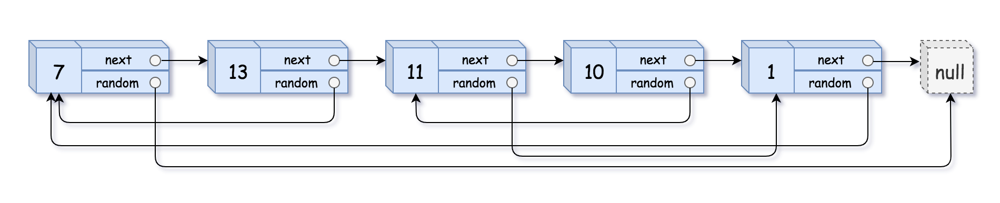

# 138. Copy List with Random Pointer

<span style="color: #f59e0b;"><strong>Medium</strong></span>

## Problem

A linked list of length n is given such that each node contains an additional random pointer, which could point to any node in the list, or null.

Construct a deep copy of the list. The deep copy should consist of exactly n brand new nodes, where each new node has its value set to the value of its corresponding original node. Both the next and random pointer of the new nodes should point to new nodes in the copied list such that the pointers in the original list and copied list represent the same list state. None of the pointers in the new list should point to nodes in the original list.

For example, if there are two nodes X and Y in the original list, where X.random --> Y, then for the corresponding two nodes x and y in the copied list, x.random --> y.

Return the head of the copied linked list.

The linked list is represented in the input/output as a list of n nodes. Each node is represented as a pair of [val, random_index] where:

val: an integer representing Node.val
random_index: the index of the node (range from 0 to n-1) that the random pointer points to, or null if it does not point to any node.
Your code will only be given the head of the original linked list.

### Example 1



```text
Input: head = [[7,null],[13,0],[11,4],[10,2],[1,0]]
Output: [[7,null],[13,0],[11,4],[10,2],[1,0]]
Explanation: The copied list has the same values and random pointer relationships as the original list.
```

### Example 2


```text
Input: head = [[1,1],[2,1]]
Output: [[1,1],[2,1]]
Explanation: Both random pointers in the copied list point to the node at index 1.
```

### Example 3


```text
Input: head = [[3,null],[3,0],[3,null]]
Output: [[3,null],[3,0],[3,null]]
Explanation: Although the node values are duplicated, each random pointer relationship is preserved.
```

Constraints:

0 <= n <= 1000
-104 <= Node.val <= 104
Node.random is null or is pointing to some node in the linked list.

https://leetcode.com/problems/copy-list-with-random-pointer/description/?envType=study-plan-v2&envId=top-interview-150

## Answer

### 解題思路

使用 `HashMap<Node, Node>` 建立「原始節點 → 複製節點」的對應關係，分成兩次走訪：

1. 第一次走訪原始串列，只建立複製節點並複製 `val`，同時將每組原始節點與複製節點存入 `HashMap`。
2. 第二次走訪原始串列，透過 `HashMap` 找到 `next` 與 `random` 對應的複製節點，再設定複製節點的兩個指標。

這樣即使 `random` 指向後方節點、自己、前方節點或 `null`，都能正確連接。Java 的 `HashMap.get(null)` 會回傳 `null`，因此不需要額外處理 `next` 或 `random` 為 `null` 的情況。

### 程式碼

```java
import java.util.HashMap;
import java.util.Map;

class Solution {
    public Node copyRandomList(Node head) {
        if (head == null) {
            return null;
        }

        Map<Node, Node> copiedNodes = new HashMap<>();
        Node current = head;

        // 第一趟只建立節點，確保每個原始節點都有唯一的複製節點。
        while (current != null) {
            copiedNodes.put(current, new Node(current.val));
            current = current.next;
        }

        current = head;
        while (current != null) {
            Node copiedNode = copiedNodes.get(current);

            // 透過對應表連接複製串列的 next 與 random 指標。
            copiedNode.next = copiedNodes.get(current.next);
            copiedNode.random = copiedNodes.get(current.random);
            current = current.next;
        }

        return copiedNodes.get(head);
    }
}
```

### 說明

`HashMap` 的鍵是原始節點，值是對應的複製節點。先完整建立所有複製節點後，第二趟才能處理 `random` 指向尚未走訪節點的情況；也能確保同一個原始節點被多個指標指向時，所有複製指標都會指向同一個複製節點，而不是重複建立節點。

若 `head` 為 `null`，直接回傳 `null`。串列只有一個節點時，`next` 會是 `null`，而 `random` 可能指向自己或 `null`，上述對應表仍能正確處理。

令 `n` 為原始 linked list 的節點數：

- 時間複雜度：`O(n)`，兩次走訪各處理每個節點一次。
- 空間複雜度：`O(n)`，`HashMap` 與複製節點共使用線性額外空間。
