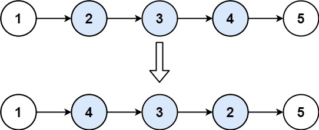

# 92. Reverse Linked List II

<span style="color: #f59e0b;"><strong>Medium</strong></span>

## Problem

Given the head of a singly linked list and two integers left and right where left <= right, reverse the nodes of the list from position left to position right, and return the reversed list.

### Example 1



```text
Input: head = [1,2,3,4,5], left = 2, right = 4
Output: [1,4,3,2,5]
Explanation: The nodes from position 2 to position 4 are reversed.
```

### Example 2

```text
Input: head = [5], left = 1, right = 1
Output: [5]
Explanation: The selected sublist contains only one node, so the list remains unchanged.
```

Constraints:

The number of nodes in the list is n.
1 <= n <= 500
-500 <= Node.val <= 500
1 <= left <= right <= n

https://leetcode.com/problems/reverse-linked-list-ii/description/?envType=study-plan-v2&envId=top-interview-150

## Answer

### 解題思路

以下兩段程式碼是獨立解法，提交到 LeetCode 時擇一即可。

#### 解法一：三指標反轉

先定位反轉區段兩側的節點：`beforeReverse` 停在第 `left - 1` 個節點，`afterReverse` 停在第 `right + 1` 個節點。接著把 `prev` 初始化為 `afterReverse`，再逐一反轉區段內的節點。這樣原本的區段頭在第一次反轉時就會接到區段後方，最後只要把 `beforeReverse.next` 接到新的區段頭即可。

反轉時維持以下關係：

1. `prev` 是 `current` 下一步要接上的節點；初始值為 `afterReverse`，之後會指向已反轉部分的開頭。
2. `current` 指向尚未反轉的第一個節點。
3. `next` 暫存 `current` 後面的節點，避免修改 `current.next` 後遺失剩餘鏈結。

定位時可以在同一次走訪中記錄兩側節點：走到 `right` 後，`afterReverse` 再前進一格，就會指向反轉區段後方的節點。反轉完成後，`prev` 是新的區段頭，將 `beforeReverse.next` 接到 `prev`，即可完成串接，不必再用迴圈結束後的 `current` 接回尾端。

```java
class Solution {
    public ListNode reverseBetween(ListNode head, int left, int right) {
        if (head == null || left == right) {
            return head;
        }

        // 虛擬頭節點可統一處理 left == 1 的情況。
        ListNode dummy = new ListNode(0);
        dummy.next = head;

        // 同一次走訪中記錄反轉區段前後的節點。
        ListNode beforeReverse = dummy;
        ListNode afterReverse = dummy;
        for (int position = 1; position <= right; position++) {
            // beforeReverse 停在第 left - 1 個節點。
            if (position < left) {
                beforeReverse = beforeReverse.next;
            }

            // afterReverse 先走到第 right 個節點。
            afterReverse = afterReverse.next;
        }
        // 再前進一格，停在反轉區段後方；若 right 是串列尾端，則為 null。
        afterReverse = afterReverse.next;

        // 以區段後方作為反轉起點；原區段頭第一次反轉時就會接到後方。
        ListNode prev = afterReverse;
        ListNode current = beforeReverse.next;

        // 使用三指標反轉 left 到 right 之間的節點。
        for (int position = left; position <= right; position++) {
            // 先保存下一個節點，避免 current.next 被修改後遺失剩餘鏈結。
            ListNode next = current.next;

            // 將 current 接到已反轉部分的前方。
            current.next = prev;

            // 三個指標一起往後推進。
            prev = current;
            current = next;
        }

        // beforeReverse 接到反轉後的區段開頭。
        beforeReverse.next = prev;

        return dummy.next;
    }
}
```

#### 解法二：頭插法

使用一個虛擬頭節點 `dummy`，讓 `left == 1` 時也能統一處理。先找到反轉區段前一個節點 `beforeReverse`，接著使用「頭插法」逐一把區段內的下一個節點移到反轉區段最前方。

反轉過程中維持以下關係：

1. `beforeReverse` 永遠指向反轉區段前一個節點。
2. `current` 是原本反轉區段的第一個節點；隨著節點被移走，它會逐漸成為反轉區段的尾端。
3. 每次將 `current.next` 摘下，插入 `beforeReverse.next`，即可讓反轉區段增加一個節點，而不需要額外的鏈結串列或陣列。

```java
class Solution {
    public ListNode reverseBetween(ListNode head, int left, int right) {
        if (head == null || left == right) {
            return head;
        }

        // 虛擬頭節點可統一處理 left == 1 的情況。
        ListNode dummy = new ListNode(0);
        dummy.next = head;

        // 找到反轉區段前一個節點。
        ListNode beforeReverse = dummy;
        for (int position = 1; position < left; position++) {
            beforeReverse = beforeReverse.next;
        }

        // current 會留在原本區段的第一個位置，最後成為反轉區段的尾端。
        ListNode current = beforeReverse.next;

        // 每次把 current 後方的節點移到反轉區段最前方。
        for (int count = 0; count < right - left; count++) {
            ListNode moved = current.next;
            current.next = moved.next;
            moved.next = beforeReverse.next;
            beforeReverse.next = moved;
        }

        return dummy.next;
    }
}
```

### 說明

- 當 `left == right` 時，反轉區段只有一個節點，不需要修改鏈結。
- `dummy` 讓從頭節點開始反轉時也能取得區段前一個節點，避免額外撰寫特殊分支。
- `n` 為鏈結串列中的節點數。兩種方法尋找起點並反轉區段最多都遍歷 `n` 個節點，因此時間複雜度皆為 `O(n)`。
- 兩種方法都只使用固定數量的指標變數，額外空間複雜度皆為 `O(1)`。
- 三指標反轉依序將目前節點接到已反轉區段前方；頭插法則每次將下一個節點移到區段開頭，兩者最後都能得到相同結果。
