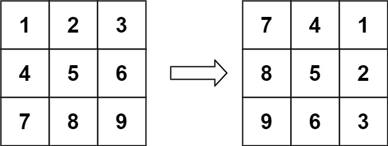
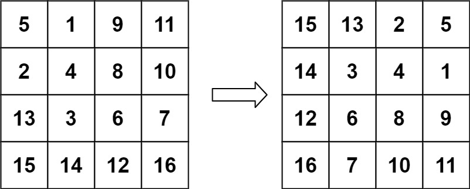

# 048. Rotate Image

## Problem

<span style="color: #f59e0b;"><strong>Medium</strong></span>

You are given an `n x n` 2D matrix representing an image. Rotate the image by 90 degrees clockwise.

You have to rotate the image in-place, which means you have to modify the input 2D matrix directly. Do not allocate another 2D matrix for the rotation.

題目連結：[LeetCode - Rotate Image](https://leetcode.com/problems/rotate-image/)

### Example 1



```text
Input: matrix = [[1,2,3],[4,5,6],[7,8,9]]
Output: [[7,4,1],[8,5,2],[9,6,3]]
```

### Example 2



```text
Input: matrix = [[5,1,9,11],[2,4,8,10],[13,3,6,7],[15,14,12,16]]
Output: [[15,13,2,5],[14,3,4,1],[12,6,8,9],[16,7,10,11]]
```

### Constraints

- `n == matrix.length == matrix[i].length`
- `1 <= n <= 20`
- `-1000 <= matrix[i][j] <= 1000`

## Answer

順時針旋轉 90 度可以拆成兩個原地操作：

1. 將矩陣沿著主對角線轉置，讓 `matrix[row][column]` 與 `matrix[column][row]` 交換。
2. 將每一列左右反轉。

例如，轉置後的矩陣會把原本的欄變成列；再將每一列反轉，就能得到順時針旋轉 90 度的結果。

轉置時只需要走訪主對角線上方的元素，避免同一組元素交換兩次。

```java
class Solution {
    public void rotate(int[][] matrix) {
        int n = matrix.length;

        // 沿主對角線轉置矩陣，只交換右上三角形，避免重複交換。
        for (int row = 0; row < n; row++) {
            for (int column = row + 1; column < n; column++) {
                int temp = matrix[row][column];
                matrix[row][column] = matrix[column][row];
                matrix[column][row] = temp;
            }
        }

        // 將轉置後的每一列左右反轉，完成順時針旋轉 90 度。
        for (int row = 0; row < n; row++) {
            int left = 0;
            int right = n - 1;

            while (left < right) {
                int temp = matrix[row][left];
                matrix[row][left] = matrix[row][right];
                matrix[row][right] = temp;
                left++;
                right--;
            }
        }
    }
}
```

### 說明

1. 轉置會將元素 `(row, column)` 移到 `(column, row)`。
2. 每列反轉會將元素 `(column, row)` 移到 `(column, n - 1 - row)`，正好符合順時針旋轉 90 度後的位置。
3. 每個元素最多被處理常數次，因此時間複雜度為 `O(n²)`。
4. 只使用暫存變數進行交換，額外空間複雜度為 `O(1)`。
