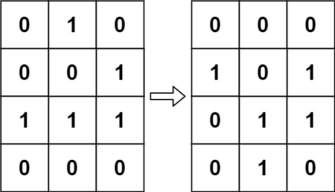
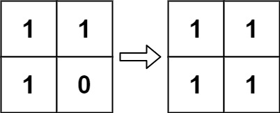

# 289. Game of Life

<!-- markdownlint-disable-next-line MD033 -->
<span style="color: #f59e0b;"><strong>Medium</strong></span>

## Problem

According to Wikipedia's article: "The Game of Life, also known simply as Life, is a cellular automaton devised by the British mathematician John Horton Conway in 1970."

The board is made up of an m x n grid of cells, where each cell has an initial state: live (represented by a 1) or dead (represented by a 0). Each cell interacts with its eight neighbors (horizontal, vertical, diagonal) using the following four rules (taken from the above Wikipedia article):

Any live cell with fewer than two live neighbors dies as if caused by under-population.
Any live cell with two or three live neighbors lives on to the next generation.
Any live cell with more than three live neighbors dies, as if by over-population.
Any dead cell with exactly three live neighbors becomes a live cell, as if by reproduction.
The next state of the board is determined by applying the above rules simultaneously to every cell in the current state of the m x n grid board. In this process, births and deaths occur simultaneously.

Given the current state of the board, update the board to reflect its next state.

Note that you do not need to return anything.

### Example 1



```text
Input: board = [[0,1,0],[0,0,1],[1,1,1],[0,0,0]]
Output: [[0,0,0],[1,0,1],[0,1,1],[0,1,0]]
Explanation: The cells are updated simultaneously according to their live-neighbor counts; cells with two or three live neighbors survive, and dead cells with exactly three live neighbors become alive.
```

### Example 2



```text
Input: board = [[1,1],[1,0]]
Output: [[1,1],[1,1]]
Explanation: The three live cells each have two live neighbors and remain alive, while the dead cell has three live neighbors and becomes alive.
```

### Constraints

- `m == board.length`
- `n == board[i].length`
- `1 <= m, n <= 25`
- `board[i][j] is 0 or 1.`

### Follow up

Could you solve it in-place? Remember that the board needs to be updated simultaneously: You cannot update some cells first and then use their updated values to update other cells.
In this question, we represent the board using a 2D array. In principle, the board is infinite, which would cause problems when the active area encroaches upon the border of the array (i.e., live cells reach the border). How would you address these problems?

Problem link: [LeetCode - Game of Life](https://leetcode.com/problems/game-of-life/)

## Answer

### 解題思路

題目要求所有細胞根據同一代的狀態同時更新，因此不能在第一輪直接把原本的 `1` 或 `0` 改成下一代的結果，否則後續計算鄰居時會讀到已更新的狀態。

可以使用四種數值暫時表示「原始狀態」與「下一代狀態」：

- `0`：原本死亡，下一代仍死亡。
- `1`：原本存活，下一代仍存活。
- `2`：原本存活，下一代死亡。
- `3`：原本死亡，下一代存活。

第一輪走訪每個細胞，檢查最多八個方向的鄰居。鄰居若是 `1` 或 `2`，代表它原本是存活狀態，因此要計入活鄰居數；`2` 雖然已被標記為死亡，但仍保留了原本存活的資訊。接著依照活鄰居數將需要改變的細胞標記成 `2` 或 `3`。

第二輪再把 `2` 還原成 `0`、`3` 還原成 `1`，完成同時更新。

```java
class Solution {
    private static final int DEAD = 0;
    private static final int LIVE = 1;
    private static final int LIVE_TO_DEAD = 2;
    private static final int DEAD_TO_LIVE = 3;

    public void gameOfLife(int[][] board) {
        if (board == null || board.length == 0 || board[0].length == 0) {
            return;
        }

        int rowCount = board.length;
        int columnCount = board[0].length;
        int[][] directions = {
            {-1, -1}, {-1, 0}, {-1, 1},
            {0, -1},            {0, 1},
            {1, -1},  {1, 0},   {1, 1}
        };

        // 第一輪只根據原始狀態計算活鄰居，並先記錄下一代狀態。
        for (int row = 0; row < rowCount; row++) {
            for (int column = 0; column < columnCount; column++) {
                int liveNeighborCount = 0;

                // 超出邊界的方向不計入鄰居。
                for (int[] direction : directions) {
                    int neighborRow = row + direction[0];
                    int neighborColumn = column + direction[1];

                    if (neighborRow < 0 || neighborRow >= rowCount
                            || neighborColumn < 0 || neighborColumn >= columnCount) {
                        continue;
                    }

                    int neighborState = board[neighborRow][neighborColumn];
                    // 1 與 2 都代表鄰居原本是存活狀態。
                    if (neighborState == LIVE || neighborState == LIVE_TO_DEAD) {
                        liveNeighborCount++;
                    }
                }

                if (board[row][column] == LIVE
                        && (liveNeighborCount < 2 || liveNeighborCount > 3)) {
                    board[row][column] = LIVE_TO_DEAD;
                } else if (board[row][column] == DEAD && liveNeighborCount == 3) {
                    board[row][column] = DEAD_TO_LIVE;
                }
            }
        }

        // 第二輪移除暫存標記，將所有細胞轉成真正的下一代狀態。
        for (int row = 0; row < rowCount; row++) {
            for (int column = 0; column < columnCount; column++) {
                if (board[row][column] == LIVE_TO_DEAD) {
                    board[row][column] = DEAD;
                } else if (board[row][column] == DEAD_TO_LIVE) {
                    board[row][column] = LIVE;
                }
            }
        }
    }
}
```

### 說明

1. 第一輪遇到邊界外的位置直接跳過，因此角落最多只有三個鄰居，邊上的細胞最多只有五個鄰居；不需要額外補上虛擬細胞。
2. 每個細胞在輪到自己判斷前仍保留原本的 `0` 或 `1`，而已處理的鄰居則透過 `2` 保留「原本存活」的資訊，所以不會受到更新順序影響。
3. `1 x 1` 矩陣也能正常處理：唯一細胞沒有活鄰居，存活細胞會死亡，死亡細胞則維持死亡。
4. 設 `m` 為列數、`n` 為欄數。每個細胞檢查固定八個方向，並在第二輪再走訪一次，因此時間複雜度為 `O(mn)`。
5. 方向陣列只有八個固定元素，除此之外只使用固定數量的變數，額外空間複雜度為 `O(1)`。

### 結論

若不考慮空間限制，最直觀的做法是使用兩個獨立的矩陣：一個保存目前狀態，另一個保存下一代狀態。計算時只讀取目前狀態，再將結果寫入下一代狀態，因此容易理解，但需要 `O(mn)` 的額外空間。

若要使用 in-place，就不能直接覆蓋原本的 `0` 或 `1`，而必須設計能同時保存「原始狀態」與「下一代狀態」的編碼。本題使用 `0、1、2、3` 表示四種狀態，讓第一輪可以讀取原始資訊並記錄轉換結果，第二輪再將暫存狀態還原成正式結果。

因此，這題 in-place 的關鍵不只是寫出狀態轉換規則，而是讓舊狀態與新狀態在更新期間共存，同時將額外空間從 `O(mn)` 降低為 `O(1)`。
