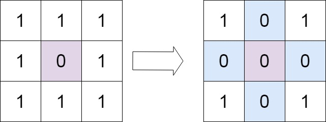
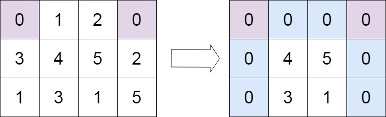

# 73. Set Matrix Zeroes

## Problem

<span style="color: #f59e0b;"><strong>Medium</strong></span>

Given an m x n integer matrix matrix, if an element is 0, set its entire row and column to 0's.

You must do it in place.

### Example 1



```text
Input: matrix = [[1,1,1],[1,0,1],[1,1,1]]
Output: [[1,0,1],[0,0,0],[1,0,1]]
Explanation: The element at matrix[1][1] is 0, so its entire row and column are set to 0.
```

### Example 2



```text
Input: matrix = [[0,1,2,0],[3,4,5,2],[1,3,1,5]]
Output: [[0,0,0,0],[0,4,5,0],[0,3,1,0]]
Explanation: The zeros in the first row set the first row, the first column, and the fourth column to 0.
```

### Constraints

- m == matrix.length
- n == matrix[0].length
- 1 <= m, n <= 200
- -231 <= matrix[i][j] <= 231 - 1

### Follow up

A straightforward solution using O(mn) space is probably a bad idea.
A simple improvement uses O(m + n) space, but still not the best solution.
Could you devise a constant space solution?

Problem link: [LeetCode - Set Matrix Zeroes](https://leetcode.com/problems/set-matrix-zeroes/)

## Answer

### 解題思路

若使用兩個陣列分別記錄需要清零的列與欄，額外空間會是 `O(m + n)`。要達到常數額外空間，可以把矩陣的第一列與第一欄當作標記區：

- `matrix[row][0] == 0` 代表第 `row` 列需要清零。
- `matrix[0][column] == 0` 代表第 `column` 欄需要清零。

第一列與第一欄本身也可能原本就含有 `0`，因此先用 `firstRowZero` 與 `firstColumnZero` 記錄它們的原始狀態，避免標記過程遺失資訊。`matrix[0][0]` 同時屬於第一列與第一欄，不能只靠它區分兩種狀態。

處理順序如下：

1. 先掃描第一列與第一欄，記錄它們是否原本含有 `0`。
2. 掃描其餘內部元素；遇到 `0` 時，將該列的第一欄與該欄的第一列設為 `0`。
3. 根據標記清零所有內部元素。
4. 最後依照兩個布林值，分別清零第一列與第一欄。

```java
class Solution {
	public void setZeroes(int[][] matrix) {
		if (matrix == null || matrix.length == 0 || matrix[0].length == 0) {
			return;
		}

		int rowCount = matrix.length;
		int columnCount = matrix[0].length;
		boolean firstRowZero = false;
		boolean firstColumnZero = false;

		// 先記錄第一列原本是否含有 0，避免後續標記覆蓋原始資訊。
		for (int column = 0; column < columnCount; column++) {
			if (matrix[0][column] == 0) {
				firstRowZero = true;
				break;
			}
		}

		// 先記錄第一欄原本是否含有 0。
		for (int row = 0; row < rowCount; row++) {
			if (matrix[row][0] == 0) {
				firstColumnZero = true;
				break;
			}
		}

		// 使用第一列與第一欄，記錄內部元素所在的列與欄是否需要清零。
		for (int row = 1; row < rowCount; row++) {
			for (int column = 1; column < columnCount; column++) {
				if (matrix[row][column] == 0) {
					matrix[row][0] = 0;
					matrix[0][column] = 0;
				}
			}
		}

		// 根據標記清零內部元素；第一列與第一欄留到最後處理。
		for (int row = 1; row < rowCount; row++) {
			for (int column = 1; column < columnCount; column++) {
				if (matrix[row][0] == 0 || matrix[0][column] == 0) {
					matrix[row][column] = 0;
				}
			}
		}

		// 只有第一列原本含有 0 時，才清零整列。
		if (firstRowZero) {
			for (int column = 0; column < columnCount; column++) {
				matrix[0][column] = 0;
			}
		}

		// 只有第一欄原本含有 0 時，才清零整欄。
		if (firstColumnZero) {
			for (int row = 0; row < rowCount; row++) {
				matrix[row][0] = 0;
			}
		}
	}
}
```

### 說明

1. 第一列與第一欄是共享的原地標記空間；兩個布林值負責保留它們原本是否含有 `0` 的資訊。
2. 內部元素必須先完成標記，再依標記清零；否則過早清零會讓後續判斷受到新產生的 `0` 影響。
3. 題目限制 `m`、`n` 至少為 `1`；程式也額外處理空矩陣。單列或單欄矩陣的內部迴圈會自然跳過，仍由布林值正確處理。
4. 判斷只檢查是否等於 `0`，因此負數與重複值不需要額外處理。
5. 設 `m` 為矩陣的列數、`n` 為欄數；每個位置被掃描常數次，時間複雜度為 `O(mn)`。
6. 只使用固定數量的變數，額外空間複雜度為 `O(1)`。