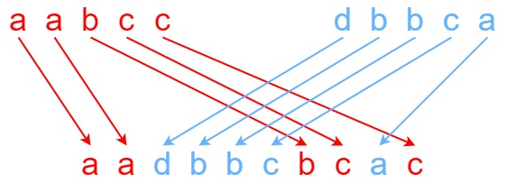

# 97. Interleaving String

<!-- markdownlint-disable MD033 -->
<span style="color: #f59e0b;"><strong>Medium</strong></span>
<!-- markdownlint-enable MD033 -->

## Problem

Given strings s1, s2, and s3, find whether s3 is formed by an interleaving of s1 and s2.

An interleaving of two strings s and t is a configuration where s and t are divided into n and m substrings respectively, such that:

s = s1 + s2 + ... + sn
t = t1 + t2 + ... + tm
|n - m| <= 1
The interleaving is s1 + t1 + s2 + t2 + s3 + t3 + ... or t1 + s1 + t2 + s2 + t3 + s3 + ...
Note: a + b is the concatenation of strings a and b.

### Example 1



```text
Input: s1 = "aabcc", s2 = "dbbca", s3 = "aadbbcbcac"
Output: true
Explanation: One way to obtain s3 is:
Split s1 into s1 = "aa" + "bc" + "c", and s2 into s2 = "dbbc" + "a".
Interleaving the two splits, we get "aa" + "dbbc" + "bc" + "a" + "c" = "aadbbcbcac".
Since s3 can be obtained by interleaving s1 and s2, we return true.
```

### Example 2

```text
Input: s1 = "aabcc", s2 = "dbbca", s3 = "aadbbbaccc"
Output: false
Explanation: Notice how it is impossible to interleave s2 with any other string to obtain s3.
```

### Example 3

```text
Input: s1 = "", s2 = "", s3 = ""
Output: true
```

### Constraints

0 <= s1.length, s2.length <= 100
0 <= s3.length <= 200
s1, s2, and s3 consist of lowercase English letters.

Follow up: Could you solve it using only O(s2.length) additional memory space?

[LeetCode Problem](https://leetcode.com/problems/interleaving-string/description/?envType=study-plan-v2&envId=top-interview-150)

## Answer

### 解題思路

令 `dp[i]` 表示目前已使用 `s1` 前綴 `i` 個字元與 `s2` 前綴 `j` 個字元時，是否能組成 `s3` 前綴。當外層處理 `s2` 的前 `j` 個字元時，這個前綴的長度就是 `i + j`。

原本是二維 `dp[i][j]`，但每個狀態只需要左方與上方，因此可以壓成一維。此版本保留 `s1` 的索引，`secondIndex` 由外層迴圈保存，所以陣列長度是 `firstLength + 1`。

處理 `s3[i + j - 1]` 時，最後一個字元只有兩種來源：

- 取自 `s1`：前一個狀態是已更新的 `dp[i - 1]`，代表目前這一列左方的狀態，也就是少使用一個 `s1` 字元。
- 取自 `s2`：前一個狀態是尚未更新的 `dp[i]`，代表上一列上方的狀態，也就是少使用一個 `s2` 字元。

只要其中一條路徑可行，`dp[i]` 就能設為 `true`。先檢查三個字串的總長度是否相等，可以立即排除不可能的情況；接著以一維陣列由左至右更新。這個版本保留 `s1` 的索引，因此額外空間是 `O(s1.length)`；若要符合題目 Follow up 的 `O(s2.length)`，只要將兩個字串的角色對調即可。

### Java 程式碼

```java
class Solution {
    public boolean isInterleave(String s1, String s2, String s3) {
        int firstLength = s1.length();
        int secondLength = s2.length();

        // 兩個來源字串的字元總數不同時，不可能組成 s3。
        if (firstLength + secondLength != s3.length()) {
            return false;
        }

        // dp[firstIndex] 表示：目前已使用 s2 前 secondIndex 個字元時，
        // s1 前 firstIndex 個字元與 s2 前 secondIndex 個字元，是否能組成
        // s3 前 firstIndex + secondIndex 個字元。陣列只保留 firstIndex，並逐列更新。
        boolean[] dp = new boolean[firstLength + 1];

        // 兩個字串都尚未使用，可以組成空的 s3 前綴。
        dp[0] = true;

        // 邊界狀態：尚未使用 s2，只能依序用 s1 前綴比對 s3 前綴。
        for (int firstIndex = 1; firstIndex <= firstLength; firstIndex++) {
            dp[firstIndex] = dp[firstIndex - 1]
                    && s1.charAt(firstIndex - 1) == s3.charAt(firstIndex - 1);
        }

        for (int secondIndex = 1; secondIndex <= secondLength; secondIndex++) {
            // 邊界狀態：firstIndex = 0，不取 s1，只判斷 s2 前綴是否能形成 s3 前綴。
            dp[0] = dp[0]
                    && s2.charAt(secondIndex - 1) == s3.charAt(secondIndex - 1);

            for (int firstIndex = 1; firstIndex <= firstLength; firstIndex++) {
                int targetIndex = firstIndex + secondIndex - 1;
                char target = s3.charAt(targetIndex);

                // dp[firstIndex - 1] 已在本列更新，是左方狀態：少取一個 s1 字元。
                boolean takeFromS1 = dp[firstIndex - 1]
                        && s1.charAt(firstIndex - 1) == target;

                // dp[firstIndex] 尚未更新，是上方狀態：少取一個 s2 字元。
                boolean takeFromS2 = dp[firstIndex]
                        && s2.charAt(secondIndex - 1) == target;

                dp[firstIndex] = takeFromS1 || takeFromS2;
            }
        }

        return dp[firstLength];
    }
}
```

### 說明

- `dp[0]` 代表只使用 `s2` 的前綴；初始化階段則代表只使用 `s1` 的前綴。這兩個邊界會逐字檢查，遇到不相等的字元後就會維持 `false`。
- 每個一般狀態只從「左方取 `s1`」或「上方取 `s2`」轉移，且最後要加入的字元必須與 `s3` 對應位置相同，因此不會漏掉任何合法交錯方式。
- 空字串也能由初始化處理：若 `s1` 與 `s2` 都是空字串，`dp[0]` 會保持 `true`；若只有一個非空，則會依序檢查另一個字串是否等於 `s3`。
- 時間複雜度為 `O(mn)`，其中 `m` 是 `s1.length()`，`n` 是 `s2.length()`；每個 DP 狀態只計算一次。
- 空間複雜度為 `O(m)`，其中 `m` 是 `s1.length()`；使用長度為 `m + 1` 的一維 DP 陣列。
